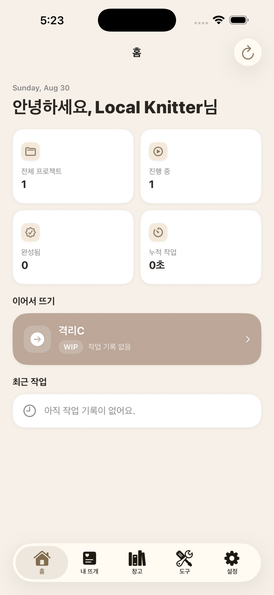
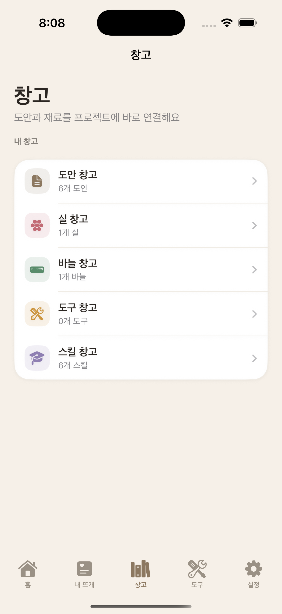
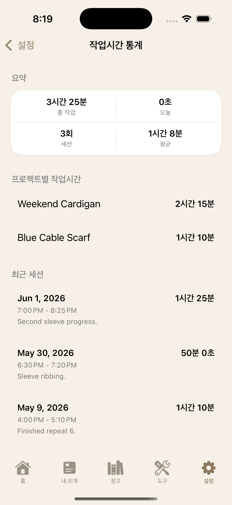

# KnitGether — iOS 앱 QA 실증 프로젝트

뜨개질 초보자를 위한 iOS 작업 관리 앱 **KnitGether**와, 이 앱을 대상으로 수행한 **QA 전체 기록**이다.

산출물은 앱이 아니라 QA다. 기획 명세 작성부터 리스크 기반 테스트 설계, 수동 실행, 결함 리포트, Appium 자동화, 뮤테이션을 통한 테스트 검출력 검증, CI 회귀 게이트까지 한 사이클을 1인 QA로 돌렸다.

구현은 AI 바이브코딩으로 진행했다. 따라서 이 기록은 **사람이 리뷰하지 않은 AI 생성 코드에서 무엇이 깨지는지**를 문서화된 기준선과 실측으로 확인한 실전 기록이기도 하다. 기획자가 자기 제품을 검증하는 편향을 줄이기 위해 5가지 원칙을 세웠고, 실행 중 지키지 못한 원칙도 기록했다([00_project_background](docs/qa/portfolio/00_project_background.md)).

<p>



</p>

## 숫자로 보는 범위

| 항목 | 규모 | 근거 문서 |
|---|---|---|
| 검증 기준선 | 기능 스펙 48건(2026-09-15), 화면 기능정의서 2편 | [02_functional_spec](docs/qa/portfolio/02_functional_spec.md), [docs/spec](docs/spec) |
| 테스트 케이스 | TC 16그룹 · UI 78건 · API 계약 29건(2026-09-15, 덮임 27·부분 2) | [09_test_case_master](docs/qa/portfolio/09_test_case_master.md) |
| 결함 | DEF 29건 (Critical 13, Major 8, Minor 6, 축 제외 2) + 스펙 신설 1건, 원인 계열 4개. 9/1 정적 점검분 8건은 실행 재현 전 | [10_defect_catalog](docs/qa/portfolio/10_defect_catalog.md) |
| 자동화 | Appium 테스트 함수 78 · Page 객체 12 | [13_automation_showcase](docs/qa/portfolio/13_automation_showcase.md) |
| 테스트의 테스트 | 뮤테이션 주입 6종으로 스위트 검출력 검증 | [13_automation_showcase](docs/qa/portfolio/13_automation_showcase.md) |
| 회귀 게이트 | GitHub Actions 워크플로 2본 | `.github/workflows/` |

최종 QA 판정은 **Go**다(2026-09-15). 9/19의 7차 전량 회귀 결과와 남은 한계는 [15_release_decision](docs/qa/portfolio/15_release_decision.md)에 기록했다. 실제 배포 이력은 없다.

## 어디부터 읽으면 되나

전체 지도는 **[docs/qa/portfolio/00_TOC.md](docs/qa/portfolio/00_TOC.md)** 다. 문서는 번호순으로 읽으며, 각 문서는 앞 문서를 판정 근거로 삼는다.

시간이 5분이라면 이 셋만: [00_project_background](docs/qa/portfolio/00_project_background.md)(셀프 QA 편향 통제) → [10_defect_catalog](docs/qa/portfolio/10_defect_catalog.md)(무엇이 깨졌나) → [13_automation_showcase](docs/qa/portfolio/13_automation_showcase.md)(무엇을 어떻게 자동화했나).

## 무엇이 QA 산출물이고 무엇이 아닌가

이 저장소에는 QA가 직접 작성한 테스트와 AI가 개발 단계에서 생성한 테스트가 섞여 있다. 섞어서 세면 숫자가 부풀려지므로 가른다.

- **QA 직접 작성** — `appium-tests/`(함수 78, POM 12), `KnitGetherQAUITests/`, `qa/mutation/`(주입 6종)
- **AI 생성, 회귀 장치로만 활용** — `KnitGetherTests/`(단위 329), `KnitGetherUITests/`, `server/test/`(e2e 117). 판정 근거로 쓰지 않는다 — AI가 쓴 단위 테스트 하나가 실제로 데이터 유실 동작(DEF-03)을 정상으로 단언하고 있었다.

상세 구분과 그 이유는 [13_automation_showcase §0](docs/qa/portfolio/13_automation_showcase.md)에 있다.

## 저장소 구조

```
docs/qa/portfolio/   QA 포트폴리오 문서 00~15 (읽는 순서·의존관계는 00_TOC)
docs/spec/           화면 기능정의서 2편, 기획서 v2.2 원본, 커밋 대조표
docs/                아키텍처 전환 기록, 로컬/온라인 방식, 보안 점검
appium-tests/        Appium UI 회귀 스위트 — tests/(TC01~16), pages/(POM), support/
qa/mutation/         결함 주입 도구 — 테스트 스위트의 검출력 검증
qa/api-tests/        pytest API 계약·DB 대조·네트워크 검증 스위트
qa/api-probes/       초기 API 스모크·회귀 셸 스크립트
KnitGether/          iOS 앱 소스 (SwiftUI)
KnitGetherQAUITests/ XCUITest QA 타깃
server/              동기화 백엔드 (Node/Prisma)
```

## Appium 스위트 실행

```bash
cd appium-tests
pip install -r requirements.txt
# 시뮬레이터·Appium 서버 기동 후
pytest tests/ -v          # 테스트 함수 78개; 9/19 7차 실행 항목 83개(82 passed, 1 skipped)
pytest tests/test_tc16_offline_sync.py -v   # 오프라인 동기화만
```

파일 이름은 TC 그룹(`test_tc08_sort_filter.py`), 함수 이름은 케이스 ID(`test_ui_33_...`)로, [09 카탈로그](docs/qa/portfolio/09_test_case_master.md)와 코드가 이름으로 직접 대응된다.
