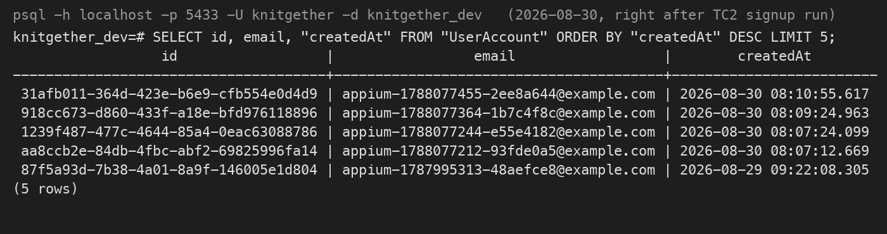
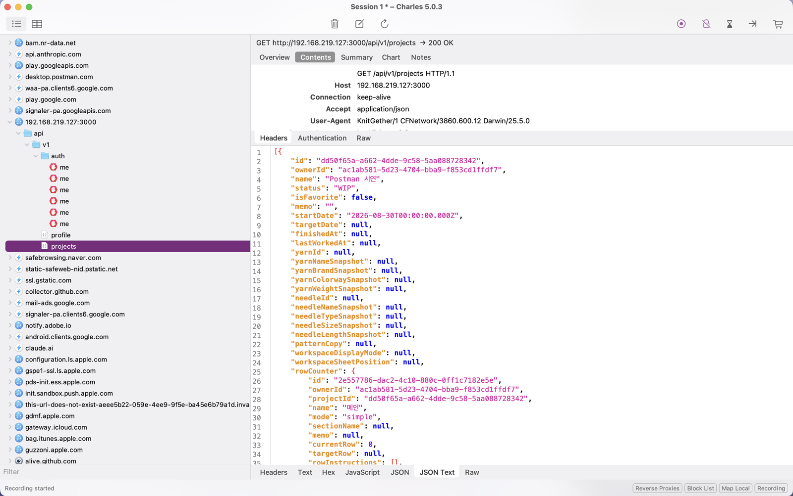
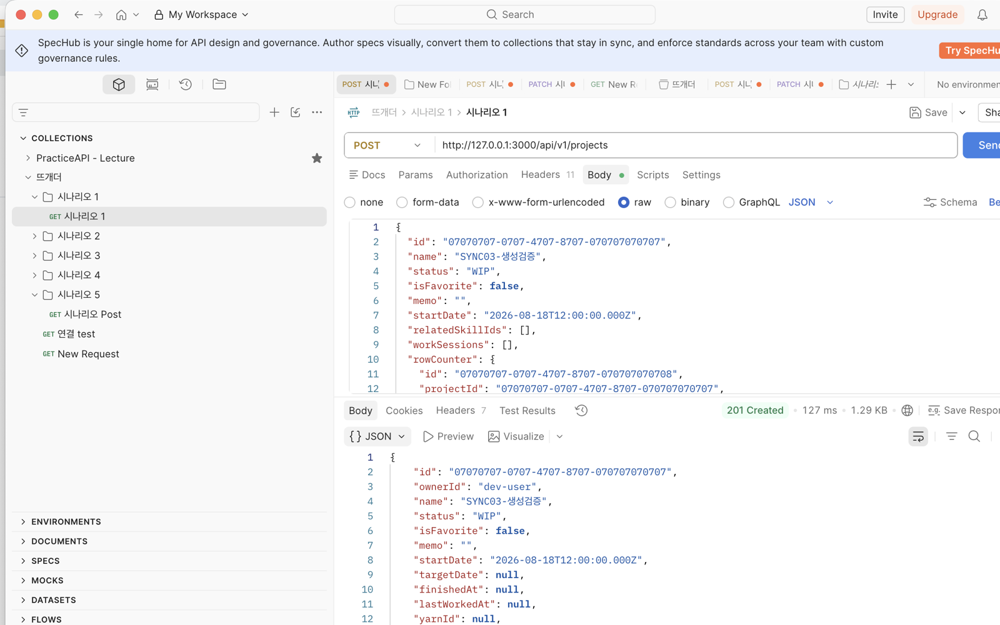
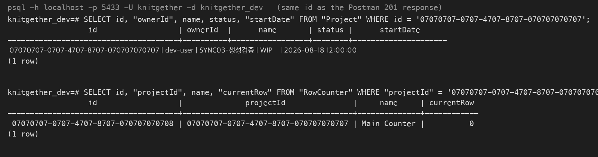

# 07_API와 네트워크 검증

> 작성 2026-08-30. 화면으로 판정할 수 없는 것을 검증한 기록이다.
> 실행 코드는 [`qa/api-tests/`](../../../qa/api-tests/)에 있고 11개 파일 37건이다.
> 06에서 이관받은 3건(SYNC-03, AUTH-01, RC-08)의 처리도 이 문서가 담당한다.

> `검수 안내` 3, 4, 5절은 실행 기록이라 실측값 그대로다. 1, 2, 6, 7절은 초안이며 하은의 판단과 문장으로 다시 쓸 자리다. 특히 1절의 관점 선언과 7절의 한계는 본인 목소리여야 한다.

---

## 1. 화면만 보면 무엇을 놓치는가

> `[초안]` 하은이 본인 문장으로 다시 쓸 자리다.

이 문서의 출발점은 한 문장이다.

**200 응답과 값이 실제로 저장된 것은 다른 사실이다.**

화면은 저장에 성공했다고 말한다. 서버는 200을 돌려줬다. 그런데 테이블에 값이 없거나, 절반만 들어갔거나, 파일이 디스크에 고아로 남아 있을 수 있다. 이 셋은 화면에서 구분되지 않는다.

DB QA에서 5년간 본 것이 이 간격이다. 애플리케이션이 정상이라고 보고하는 것과 데이터가 실제로 정합한 것은 다른 층위이고, 후자는 쿼리를 던져야 보인다. 앱/웹 QA로 옮기면서 이 관점을 버릴 이유가 없었다.

그래서 이 사이클의 API 검증은 응답 코드에서 멈추지 않는다. 모든 판정이 psql로 서버 DB 실제 상태를 대조하고, 파일을 다루는 케이스는 디스크까지 확인한다.

---

## 2. 검증 층위를 셋으로 나눈다

> `[초안]` 하은이 본인 문장으로 다시 쓸 자리다.

| 층 | 무엇을 보는가 | 도구 | 놓치면 생기는 일 |
| --- | --- | --- | --- |
| 1 응답 | status, schema, 에러 코드 | requests | 계약 위반이 클라이언트에서 터진다 |
| 2 DB | 저장값, 자식 레코드, 고아 행 | psql | 성공 응답 뒤에서 데이터가 깨진다 |
| 3 파일 | 스토리지 키와 실제 파일 | 파일 시스템 대조 | 삭제한 것이 디스크에 영원히 남는다 |

층을 나눈 이유는 각 층이 서로를 가려주기 때문이다. 1층만 보면 2층의 부분 저장이 안 보이고, 2층까지만 봐도 3층의 파일 고아화는 드러나지 않는다. RC-08이 정확히 그 사례이고 4절에서 다룬다.

셋 중 2층을 기본으로 둔다. 1층은 서버가 무엇을 말했는지만 알려주고 3층은 파일을 다루는 케이스에만 해당하는데, 데이터가 실제로 어떻게 남았는지는 2층에서만 보인다. 이 문서의 모든 판정이 psql 조회를 포함하는 것도 그래서다. 화면과 API만 보는 검증과 갈리는 지점이 여기다.

이 구조가 그대로 실행 코드에 나타난다. 예를 들어 프로젝트 삭제를 검증할 때는 이렇게 본다.

```python
# 1층 응답: 삭제는 성공한다
assert account_a.api.delete(f"/projects/{pid}").status_code == 204

# 2층 DB: 소프트 삭제로 표시된다. 여기까지만 보면 정상이다
key_after, deleted_after = _storage_key(db, pid)
assert deleted_after is not None

# 3층 파일: 남아 있다. 이것이 RC-08이다
assert path.exists()
```

2층을 실제로 보는 모습이다. TC2 회원가입 자동 실행 직후 psql로 `UserAccount`를 조회하면 테스트가 만든 계정 4행이 생성 시각과 함께 남아 있다. 화면의 PASS와 이 행이 같이 있어야 가입이 성공한 것으로 판정한다.



---

## 3. API 계약 검증

### 3-1. 케이스와 실행 코드 대조

09의 API 케이스 25건이 실행 코드 어디에 덮이는지 대조했다. 덮임 판정은 그 케이스의 검증 내용을 실제로 단언하는 테스트가 있는지 기준이고, 부수적으로 지나가기만 하는 것은 부분으로 본다.

| 집계 | 초기 대조 | 최종 |
| --- | --- | --- |
| 덮임 | 8 | 15 |
| 부분 | 5 | 5 |
| 미커버 | 12 | 5 |

두 번에 걸쳐 채웠다.

1. 비용이 낮은 인증 계약 5건(API-02, 03, 04, 08, 09)을 `test_10_auth_contract.py`로
2. 03의 P1인 RC-01 동기화 유실 3건(API-18, 19, 20)을 `test_11_sync_loss_regression.py`로

### 3-2. 남은 5건을 남긴 근거

미커버 5건은 시간이 없어서가 아니라 우선순위 때문에 남겼다.

| 케이스 | 결함 | 등급 | 판단 |
| --- | --- | --- | --- |
| API-21 | DEF-08 (RC-04) | P2 | 보류 |
| API-22 | DEF-09 (RC-07) | P3 | 보류 |
| API-23, 24 | DEF-13, 14 | 치명도 축 밖 | 보류 |
| API-17 | 창고 CRUD | 기본 동작 | 보류 |

04가 P1을 먼저 보기로 했으므로 P1인 API-18, 19, 20만 채우고 나머지는 근거를 남기고 뺐다. 자르는 근거가 우선순위에 있다는 점이 전부 채우는 것보다 중요하다.

### 3-3. 실행 코드 구성

| 파일 | 담당 | 건수 |
| --- | --- | --- |
| `test_01_ownership_isolation` | 계정 격리 | 1 |
| `test_02_last_write_wins` | 충돌 미감지 증명 | 1 |
| `test_03_create_idempotency` | 오프라인 재전송 멱등성 | 1 |
| `test_04_delete_cascade` | 삭제 연쇄 정합성 | 1 |
| `test_05_transaction_atomicity` | 트랜잭션 원자성, 500 누수 | 3 |
| `test_06_auth_and_boundaries` | 인증 경계, 입력 경계값 | 6 |
| `test_07_last_worked_at` | API-25 (DEF-17 회귀) | 4 |
| `test_08_network_degradation` | 네트워크 열화 | 6 |
| `test_09_transferred_from_06` | 이관 3건 | 4 |
| `test_10_auth_contract` | 인증 계약 | 5 |
| `test_11_sync_loss_regression` | RC-01 동기화 유실 회귀 | 5 |
| | 합계 | 37 |

최종 실행 결과는 36 passed, 1 skipped이다. 남은 스킵 1건은 Issue #15 특성화로 의도된 것이다.

### 3-4. 설계에서 신경 쓴 두 가지

경계는 양쪽을 본다. 비밀번호 길이 규칙 검증에서 7자와 257자 거부만 확인하면 그 거부가 길이 때문인지 다른 이유인지 갈리지 않는다. 8자와 256자가 통과하는 것까지 봐야 규칙이 길이라는 것이 증명된다.

응답 코드가 같은지도 본다. 로그인 실패에서 비밀번호 오류와 없는 계정이 다른 코드로 돌아오면 계정 존재 여부가 새어 나간다. 그래서 두 응답이 같은 401인지를 단언한다.

```python
assert wrong_pw.status_code == unknown.status_code, (
    "비밀번호 오류와 없는 계정의 응답 코드가 다르다. 계정 존재 여부가 새어 나간다"
)
```

---

## 4. 06에서 이관받은 3건

화면으로 판정할 수 없어 06에서 넘어온 항목들이다. 셋 다 화면에 나오지 않는 것을 본다. 어떤 HTTP 동사를 썼는지, 토큰 안에 든 만료 시각, 디스크에 남은 파일이다.

Charles가 앱 트래픽을 잡은 장면이다. `User-Agent: KnitGether/1`이 시뮬레이터 앱의 요청임을 증명하고, 응답 본문에 서버가 돌려준 `Project`와 `rowCounter`가 그대로 보인다. 04에 적은 대로 시뮬레이터가 macOS 프록시를 따르지 않는 경우가 있어, 이 날은 Charles Reverse Proxy(로컬 3998을 서버 3000으로 전달)로 앱을 통과시켰다.



### 4-1. SYNC-03 원격 반영의 POST와 PATCH 분기

Postman으로 POST를 보내 201을 받은 뒤 같은 id를 psql로 조회한 장면이다. 응답 본문의 `ownerId`, `name`, `status`가 `Project` 행과 일치하고 `RowCounter` 행이 `projectId`로 연결돼 있어야 생성이 성립한 것으로 본다.





클라이언트는 synced 항목이면 PATCH, 아니면 POST를 쓴다(`RemoteProjectRepository.swift:34`). 어떤 동사를 골랐는지는 서버에서 볼 수 없다. 그래서 그 분기가 성립하려면 서버가 무엇을 보장해야 하는지를 대신 고정했다.

| 검증 | 결과 |
| --- | --- |
| 없는 항목에 PATCH | 거부(400/404) |
| 같은 UUID로 POST 2회 | 한 건으로 수렴 |

없는 항목에 PATCH가 통과하면 클라이언트가 synced로 잘못 판단했을 때 서버가 조용히 새로 만들어 버려 유실을 알아챌 수 없다. 이 방어가 offline-first의 전제다.

### 4-2. AUTH-01 토큰 저장 위치와 만료

서버 절반만 이 문서가 담당한다. 토큰 만료가 설정을 따르는지는 여기서 보고, Keychain 저장 위치는 클라이언트라 08의 simctl 경로에 남긴다.

| 검증 | 결과 |
| --- | --- |
| 토큰 수명 | 설정값 2,592,000초(30일)과 일치 |

작성 중에 확인된 사실이 하나 있다. 토큰에 `iat` 클레임이 없다. 발급 시각을 토큰만으로 알 수 없어 수명을 직접 빼지 못하고, 방금 발급받았다는 전제로 현재 시각에서 계산했다. 결함으로 올릴 만한 것은 아니지만 토큰 감사가 필요해지면 걸리는 지점이다.

### 4-3. RC-08 파일 고아화

03이 "07에서 psql과 server/storage 대조로 실증한다"고 지정한 항목이다. 응답, DB, 파일 세 층을 모두 봐야 잡히는 유일한 케이스다.

프로젝트를 삭제하면 이렇게 된다.

| 층 | 결과 | 어떻게 보이는가 |
| --- | --- | --- |
| 응답 | 204 | 정상 |
| DB | `deletedAt` 기록됨 | 정상 |
| 파일 | PDF가 그대로 남음 | 고아 |

**앞 두 층만 보면 삭제가 완벽하다.** 원인은 `projects.service.ts`의 삭제 경로에서 `fileStorage.remove`가 `patternCopy.fileStorageKey`에 대해 호출되지 않는 것이다. 명시적 삭제 엔드포인트(진행 사진, 드로잉)와 PDF 교체 경로에서는 호출되지만, 프로젝트 삭제 경로에는 없다.

개별 재현과 별도로 누적 규모도 셌다.

| 실측 시점 | 디스크 | 살아있는 참조 | 고아 |
| --- | --- | --- | --- |
| 2026-08-29 최초 | 30 | 8 | 22 |
| 2026-08-30 현재 | 41 | 8 | 33 |

하루 사이에 11건이 늘었고 그중 상당수가 이 검증 자체가 만든 것이다. 테스트가 프로젝트를 만들고 PDF를 올린 뒤 삭제할 때마다 고아가 하나씩 쌓였다. 의도한 것은 아니지만 축적 속도를 보여주는 실측이 됐다.

운영 리스크는 건당 심각도가 아니라 쌓이는 속도로 판단해야 한다. 사용자 데이터 훼손이 없어 03에서 치명도 축 밖으로 뺀 판단은 유지하되, 참조되지 않는 파일이 전체의 80퍼센트라는 사실은 별도 관리 항목으로 남는다.

---

## 5. 네트워크 열화

### 5-1. Charles 대신 코드로 만든 이유

열화 조건을 GUI 도구가 아니라 파이썬 TCP 프록시(`appium-tests/support/netgate.py`)로 만들었다. 이유는 셋이다.

1. 재현성. GUI에서 건 조건은 증거가 스크린샷으로만 남는다. 코드로 건 조건은 그대로 다시 돈다.
2. CI 진입 가능. Charles는 게이트가 될 수 없다. 09의 CI 잡에 들어간 것이 이 프록시다.
3. 서버 상태 불침해. 서버 프로세스를 죽였다 살리면 다른 케이스가 쓰는 상태까지 건드린다. 프록시만 조작하면 서버는 살아 있다.

만들 수 있는 조건은 다섯 가지다.

| 조건 | 무엇을 만드는가 |
| --- | --- |
| `close()` | 완전 단절. 재연결도 안 된다 |
| `cut()` | 열린 연결만 끊는다. 전송 중 회선 절단 |
| `latency_ms` | 왕복 지연 |
| `bandwidth_bps` | 대역폭 상한 |
| `freeze(direction)` | 전송 정지. Charles breakpoint 자리 |

`freeze`에 방향이 있는 것이 핵심이다. `"down"`이면 요청은 서버까지 가고 응답만 막힌다. 사용자가 기다리다 이탈하는 상황이 이것이라, 서버는 처리를 끝냈는데 클라이언트만 모르는 상태가 된다.

### 5-2. 열화가 실제로 걸리는지 먼저 증명한다

조건을 걸었다는 사실과 조건이 실제로 걸렸다는 사실은 다르다. 걸리지 않으면 그 뒤 판정이 전부 무의미하므로, 도구 자체의 검출력을 먼저 잰다.

| 조건 | 응답 시간 |
| --- | --- |
| 정상 | 5ms |
| 지연 300ms | 617ms |
| 대역폭 8,000bps | 242ms |

지연을 걸었을 때 왕복 두 번(요청과 응답)에 각각 적용되어 약 600ms가 되는 것이 확인된다.

### 5-3. 검증 6건

| 케이스 | 무엇을 보는가 | 결과 |
| --- | --- | --- |
| 프록시 투명성 | 조건 없이 프록시를 거쳐도 결과가 같은가 | PASS |
| 지연 적용 | 열화 도구가 실제로 동작하는가 | PASS |
| 완전 단절과 복구 | 단절 중 실패, 복구 후 정상인가 | PASS |
| 응답 정지 중 커밋 | 클라이언트가 포기해도 서버는 온전한가 | PASS |
| 커밋 후 회선 리셋 | 고아 자식 레코드가 남는가 | PASS |
| 복구 후 재전송 | 중복 생성이 되는가 | PASS |

넷째와 다섯째가 이 절의 핵심이다. 둘 다 서버가 처리를 끝낸 뒤 클라이언트가 결과를 못 받는 상황인데, 하나는 타임아웃이고 하나는 연결 리셋이다. 클라이언트가 보는 것은 둘 다 실패지만 서버가 겪는 일은 다르다. 두 경우 모두 부분 커밋과 고아 레코드가 없음을 psql로 확인했다.

### 5-4. 스트리밍 관점

네트워크 열화 비중을 키운 것은 이 앱이 offline-first 동기화 구조이기 때문이기도 하지만, 회선이 나쁠 때의 동작이 사용자 경험의 중심인 제품군을 염두에 둔 것이다. 재생이든 동기화든 질문은 같다. 회선이 흔들릴 때 데이터가 깨지는가, 사용자가 이탈했을 때 서버는 어떤 상태로 남는가.

---

## 6. 발견과 판정

> `[초안]` 하은이 본인 문장으로 다시 쓸 자리다.

### 6-1. DEF-20 저장되지 않은 rowCounter id 참조 시 500 누수

| 항목 | 내용 |
| --- | --- |
| 결함 클래스 | 검증 공백 |
| 재현 조건 | 기존 프로젝트에 새 `rowCounter.id`를 보내면서 행 지시를 함께 전송 |
| 검증 방법 | 응답 코드 확인 + 서버 로그의 Prisma 오류 코드 대조 |
| 결과 | 500. `RowInstruction_rowCounterId_fkey` 외래키 위반(P2003) |

조건별로 나누면 이렇다.

| 조건 | 응답 |
| --- | --- |
| 행 지시 없음 | 200 |
| 카운터 id 유지 + 행 지시 | 200 |
| 카운터 id 새로 + 행 지시 | 500 |

서버는 카운터를 프로젝트당 1:1로 유지해 클라이언트가 보낸 새 id를 저장하지 않는다. 그런데 행 지시는 그 저장되지 않은 id를 참조하도록 만들어져 외래키가 터진다. `ROW_COUNTER_NOT_FOUND` 가드가 이미 있으나 지시의 `rowCounterId`가 본문의 카운터 id와 같은지만 보고, 본문의 카운터 id가 실제 저장된 것과 같은지는 보지 않아 불완전하다.

클라이언트가 UUID를 만들어 보내는 구조라 이 상황이 만들어질 수 있고, 그때 사용자가 받는 것은 처리 가능한 4xx가 아니라 내부 오류다.

발견 경위가 이 항목의 값이다. 결함을 찾으러 간 것이 아니라, 전체 API 스위트를 처음 통합 실행했을 때 원자성 테스트가 실패해 그 주입이 실제로 작동하는지 확인하다 나왔다.

### 6-2. 원자성 테스트가 검출력을 잃고 있었다

통합 실행에서 `test_05_transaction_atomicity`가 실패했다. 단독 실행에서도 실패해 다른 파일의 간섭은 아니었고, 원인은 제품이 아니라 테스트였다.

이 테스트는 `workSession` 중복 PK로 실패를 주입했는데, DEF-01과 02 수정 커밋(`d0a753a`)이 그 경로를 full-replace에서 증분 upsert로 바꾸면서 중복 id가 더 이상 던지지 않게 됐다. 주입이 작동하지 않으면 원자성은 검증되지 않은 채 남는데, 그 사실이 "원자성 의심"이라는 제품 결함 메시지로 잘못 보고되고 있었다.

아직 full-replace로 남아 있는 `rowInstruction`으로 주입 지점을 옮겨 검출력을 되살렸다. 그리고 주입이 진짜 중복 PK 때문인지 확인하는 케이스를 함께 넣었다. 서로 다른 id 2건이 통과해야 한다는 단언이다.

이 확인이 두 번 값을 했다. 처음에는 필드명을 잘못 써서 400이 검증 거부에서 나왔고, 고친 뒤에는 6-1의 500이 드러났다.

### 6-3. 공허한 판정 네 건을 작성 중에 잡았다

이 사이클에서 반복적으로 나타난 유형이다. 테스트가 통과하지만 아무것도 보지 않는 상태.

| 위치 | 왜 공허했나 | 조치 |
| --- | --- | --- |
| 정지 중 부분 저장 | 양방향을 막아 서버에 요청이 닿지 않음. 0건과 0건 비교 | 응답 방향만 막고 요청 도달을 먼저 단언 |
| 전송 중 절단 | 대역폭 제한으로 요청이 도달 못 해 고아가 당연히 0 | 요청을 온전히 보낸 뒤 응답 도중 절단 |
| 거부 후 세션 보존 | 전제가 비면 빈 집합끼리 비교 | 시딩된 두 건의 존재를 먼저 단언 |
| 원자성 주입 | 필드명 오류로 400이 검증 거부에서 발생 | 주입 작동 여부를 별도 케이스로 고정 |

네 건 모두 판정 전에 전제를 단언하는 것으로 해결됐다. 무엇을 보는지보다 무엇이 준비되어 있어야 하는지를 먼저 쓰는 습관이 이 사이클에서 얻은 것이다.

### 6-4. 검출력 확인

새로 쓴 테스트는 전부 기대값을 뒤집은 대조본을 만들어 실패하는지 확인했다.

| 파일 | 뒤집은 단언 | 대조본 결과 |
| --- | --- | --- |
| `test_07` API-25 | 3건 | 3건 실패 |
| `test_08` 네트워크 | 4건 | 4건 실패 |
| `test_10` 인증 계약 | 4건 | 4건 실패 |
| `test_11` 동기화 유실 | 5건 | 5건 실패 |

통과만으로는 제품이 정상인지 테스트가 눈을 감고 있는지 구분되지 않는다. **뒤집었을 때 빨개지는 것을 확인해야 통과가 증거가 된다.**

---

## 7. 한계

> `[초안]` 하은이 본인 문장으로 다시 쓸 자리다.

### 7-1. 서버 절반만 본 항목이 있다

| 항목 | 본 것 | 못 본 것 |
| --- | --- | --- |
| AUTH-01 | 토큰 만료가 설정을 따르는가 | Keychain 저장 위치 |
| API-19 | 서버가 거부하면서 기존 상태를 지키는가 | 클라이언트의 localOnly 보존 |
| SYNC-03 | 분기가 기대는 서버 계약 | 클라이언트가 실제로 고른 동사 |

셋 다 클라이언트 쪽이 남았고 08의 UI 자동화 트랙이 담당한다. 경계를 흐리지 않고 부분으로 표기했다. 09의 대조표에서 API-19가 부분으로 남아 있는 이유가 이것이다.

### 7-2. 미커버 5건

3-2에 근거를 적었다. P2 이하이거나 치명도 축 밖이라 뺀 것이고, 시간이 더 있었다면 API-17 창고 CRUD부터 채웠을 것이다.

### 7-3. 고아 파일을 늘리면서 검증했다

4-3에서 적은 대로 이 검증 자체가 고아를 만들었다. 테스트가 스토리지를 정리하지 않는 설계인데, RC-08이 미수정 상태라 정리 경로가 제품에 없기 때문이다. 테스트 후처리를 직접 붙일 수도 있었으나 그렇게 하면 축적을 관측할 수 없어진다. 관측을 택했고, 그 대가로 개발 환경 스토리지에 쓰레기가 남는다.

### 7-4. 실기기와 실제 네트워크는 보지 않았다

프록시로 만든 열화는 통제된 조건이라 재현 가능한 대신 실제 이동통신망의 불규칙성을 재현하지 못한다. 패킷 손실, 지터, 셀 전환은 이 도구로 만들 수 없다. 실기기 검증이 필요한 영역으로 남긴다.

---

## 부록. 실행 방법

```bash
# 사전
docker compose -f server/docker-compose.yml up -d     # Postgres 5433
cd server && npm run start:dev                        # API 3000

# 전체
cd qa/api-tests && ./.venv/bin/python -m pytest -v

# 층별
./.venv/bin/python -m pytest test_08_network_degradation.py   # 네트워크 열화
./.venv/bin/python -m pytest test_09_transferred_from_06.py   # 이관 3건
./.venv/bin/python -m pytest test_11_sync_loss_regression.py  # RC-01 회귀
```

CI에서는 `ci.yml`의 `api` 잡이 같은 스위트를 돌린다. 수동 실행 시 `scope=api-only`를 고르면 macOS 러너를 쓰는 ios 잡을 건너뛴다.
