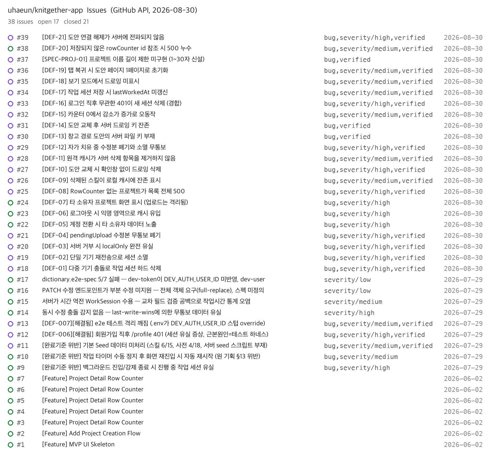

# 10_결함 카탈로그

> 원본: 구글시트 [뜨개더 TC 설계](https://docs.google.com/spreadsheets/d/1EjP0M0_BcFdMvJmjDk8-u-56_toANB4j084Hs7Bh4mI/) `결함 대장` 탭 (최종 갱신 2026-08-24).
> 재현 절차 전문, psql 원문, 발견 시각은 06과 그 부록이 정본이다. 이 문서는 결함의 계보와 상태를 한자리에 모은 카탈로그다.

`수정 커밋` 열의 해시는 2026-09-19에 리포지토리에서 전건 실재 확인했다(2026-09-19 정정). 8/27 확인 때 적은 DEF-08 해시 `06c7a10`은 리포지토리에 없는 값이었다. **커밋이 존재한다는 사실이지 회귀 검증이 끝났다는 판정이 아니다.** 회귀 판정은 `회귀 담당` 열의 케이스를 실행해야 나온다.

---

## 1. 발견 시점 분류

00에서 선언한 세 범주다.

| 범주 | 건수 | 해당 |
| --- | --- | --- |
| QA 신규 발견 (05 설계 케이스 실행) | 9 | DEF-01~05, 07~10 |
| QA 신규 발견 (탐색 관찰, 케이스 밖) | 5 | DEF-06, 11, 12, 13, 14 |
| QA 사이클 중 발생한 회귀 | 1 | DEF-15 |
| QA 신규 발견 (2차 자동화 준비 단계) | 4 | DEF-16~19 |
| QA 신규 발견 (2차 07 API 트랙) | 2 | DEF-20, DEF-22 |
| QA 신규 발견 (05 설계 케이스 실행, 기록 누락분) | 1 | DEF-21 |
| QA 신규 발견 (9/1 정적 점검) | 6 | DEF-24~29 |
| 핸드오프 known issue 확정 | 1 | DEF-23 |
| 명세 공백 → 스펙 신설 | 1 | SPEC-PROJ-01 |

DEF-01은 핸드오프 known issue #16의 동작을 실측으로 확정한 것이다. 문서에 적혀 있던 것과 실제로 데이터가 사라지는 것을 확인한 것은 구분한다.

---

## 2. 결함 대장 (DEF-01 ~ DEF-29, SPEC-PROJ-01)

| ID | 제목 | 분류 | 심각도 | 발견 시점 | 발견 경위 | 상태 (2026-09-19 정정) | 수정 커밋 | 회귀 담당 | 이슈 |
| --- | --- | --- | --- | --- | --- | --- | --- | --- | --- |
| DEF-01 | 다중 기기 충돌로 작업 세션 하드 삭제 | RC-01 동기화 유실 | Critical | 8월 초 (06 수동) | TC-SYNC08-01 실행 | 수정 완료 | `d0a753a` 서버 증분 upsert (8/9) | API-18 | #18 |
| DEF-02 | 단일 기기 재전송으로 세션 소멸 | RC-01 동기화 유실 | Critical | 8월 초 (06 수동) | TC-SYNC08-02 실행 | 수정 완료 | `d0a753a` 계열 | API-18 | #19 |
| DEF-03 | 서버 거부 시 localOnly 완전 유실 | RC-01 동기화 유실 | Critical | 8월 초 (06 수동) | TC-SYNC09-01 실행 | 수정 완료 | `eab799d` conflict 보존 (8/9) | API-19 | #20 |
| DEF-04 | pendingUpload 수정본 무통보 폐기 | RC-01 동기화 유실 | Critical | 8월 초 (06 수동) | TC-SYNC10-01 실행 | 수정 완료 | conflict 보존 계열 | API-20 | #21 |
| DEF-05 | 계정 전환 시 타 소유자 데이터 노출 | RC-02 계정 격리 | Critical | 8월 초 (06 수동) | TC-AUTH04-01 실행 | 수정 완료 (9/6) | `9ba16c9` 로그아웃 시 계정 저장소 정리 | AppRepositoryContainerTests | #22 |
| DEF-06 | 로그아웃 시 익명 영역으로 캐시 유입 | RC-02 계정 격리 | Critical | 8월 초 (탐색 관찰) | DEF-05 조사 중 캐시 폴더 실측 | 수정 완료 (9/6) | `4d76203` 게이트 (8/11) + `9ba16c9` 저장소 정리 | AppRepositoryContainerTests | #23 |
| DEF-07 | 타 소유자 프로젝트 화면 표시 (업로드는 격리됨) | RC-02 계정 격리 | Critical | 8월 초 (06 수동) | TC-AUTH05-01 실행 | 수정 완료 (9/6) | `9ba16c9` DEF-05와 동일 계열 | AppRepositoryContainerTests | #24 |
| DEF-08 | RowCounter 없는 프로젝트가 목록 전체 500 | RC-04 데이터 계약 | **Critical** (8/29 판정) | 8월 초 (06 수동) | TC-CNT03-01 실행 | 수정 완료 (회귀 확인) | `7defe1c` 목록 격리 (8/6) | API-21 | #25 |
| DEF-09 | 삭제된 스킬이 로컬 캐시에 잔존 표시 | RC-07 죽은 ID 표시 | Major | 8월 초 (06 수동) | TC-LINK03-01 실행 | 수정 완료 | 캐시 프루닝 계열 | API-22 | #26 |
| DEF-10 | 도안 교체 시 확인창 없이 드로잉 삭제 | **RC-01 동기화 유실** (8/29 재분류, 원래 RC-03) | **Critical** (8/29 판정) | 8월 초 (06 수동) | TC-LINK01-01 실행 | 수정 완료 (회귀 확인) | `8f1a4ad` 네 진입점 확인창 (8/9) | UI-45 | #27 |
| DEF-11 | 원격 캐시가 서버 삭제 항목을 제거하지 않음 | 캐시 갱신 전략 | Major | 8월 초 (탐색 관찰 31) | psql 삭제 후 잔존 확인 | 수정 완료 | 캐시 스테일 제거 | UI-28 간접 | #28 |
| DEF-12 | 자가 치유 중 수정분 폐기와 소멸 무통보 | RC-01 동기화 유실 | Critical | 8월 초 (탐색 관찰 32) | DEF-11 재현 중 관찰 | 수정 완료 | conflict 보존 계열 | API-20 | #29 |
| DEF-13 | 창고 경로 도안의 서버 파일 키 부재 | 파일 정합성 (RC-08, 운영 리스크) | 심각도 축 제외 (8/29) | 8월 초 (탐색 관찰) | 07 추적 | 수정 완료 | `a74945a` (8/11) | API-23, UI-43 | #30 |
| DEF-14 | 도안 교체 후 서버 드로잉 키 잔존 | 파일 정합성 (RC-08, 운영 리스크) | 심각도 축 제외 (8/29) | 8월 초 (탐색 관찰 37) | psql 키 확인 | 수정 완료 | `0109898` 레코드 재생성 (8/9) | API-24 | #31 |
| DEF-15 | 카운터 0에서 감소가 증가로 오동작 | 회귀 (UX 개편 유발) | **Major** (8/29 판정) | 8월 초 (06 실행 중) | TC-CNT01-01 실행 | 수정 완료 (자동화) | `3bc32f8` 0에서 감소 가드 (8/6), `34f3c00` 겹침 제거 (8/6) | UI-39, UI-54 + CI 게이트 | #32 |
| DEF-16 | 로그인 직후 무관한 401이 새 세션 삭제 (경합) | 세션 정합성 | **Critical** (8/29 판정) | 8/22~23 (자동화 준비) | 실기기 탐색 + 서버 계측 | 수정 완료 (검증) | `4f7e25e` 토큰 소지 요청만 삭제 (8/23) | UI-08 (증상 감시) | #33 |
| DEF-17 | 작업 세션 저장 시 lastWorkedAt 미갱신 | RC-03 표시 정합성 + 데이터 계약 | Major | 8/23 (케이스 설계) | UI-33 설계 중 정렬 관찰 → 코드 대조 → `projects.json` 실증 | 수정 (8/26), 종료 (8/30) | `543ae7f` (8/26) | UI-33, 35, 38, API-25 | #34 |
| DEF-18 | 보기 모드에서 드로잉 미표시 | RC-03 표시 정합성 | Major | 8/23 (케이스 설계) | UI-48 실행 중 관찰 | 수정 (8/26), 종료 (8/30) | `d1c6010` (8/26) | UI-49 | #35 |
| DEF-19 | 탭 복귀 시 도안 페이지 1페이지로 초기화 | RC-03 표시 정합성 | **Major** (8/29 판정) | 8/23 (케이스 설계) | UI-51 실행 중 관찰 | 수정 (8/26), 종료 (8/30) | `d1c6010` (8/26) | UI-51 | #36 |
| SPEC-PROJ-01 | 프로젝트 이름 길이 제한 미구현 (1~30자 신설) | 명세 공백 → 스펙 신설 | 심각도 축 제외 (8/29) | 8/23 (케이스 설계) | UI-17 설계 중 코드 3층 확인 | 구현 (8/26), 종료 (8/30) | `834876f` (8/26) | UI-17 | #37 |
| DEF-20 | 저장되지 않은 rowCounter id 참조 시 500 누수 | 검증 공백 | **Major** (8/30 확정) | 8/29 (07 트랙) | API 원자성 주입 확인 중 발견 | 수정 (9/3), 종료 (9/6) | `1637acc` 입력 계약 가드 (9/3) | `test_05_transaction_atomicity.py::test_unknown_row_counter_id_is_rejected_without_mutation` | #38 |
| DEF-21 | 도안 연결 해제가 서버에 전파되지 않음 | RC-01 동기화 유실 | **Critical** (8/30 확정) | 8/5 (06 수동, 실기기) | TC-CUJ3-01 실행 중 발견 | 수정 (8/10), 종료 (8/30) | `e1b25ad` (8/10) | UI-46, TC-CUJ3-01 | #39 |
| DEF-22 | 필수 중첩 필드(rowCounter) 누락이 400 대신 500 누수 | 검증 공백 | **Major** (8/31 확정) | 8/31 (2차 07 API 트랙) | API-07 필수 필드 보강 테스트 작성 중 발견 | 수정 (9/3), 이슈 없음 | `1637acc` `@IsDefined()` 추가 (9/3) | `test_16_coverage_promotions.py::test_api_07_missing_row_counter_is_rejected_without_insert` | 미등록 |
| DEF-23 | 앱 백그라운드 진입 시 작업 세션이 종료되지 않음 | 카운트 부정확 (01 치명도 4위, 03 결함 클래스 없음. 2026-09-19 정정) | **Critical** (9/1 확정) | **7/29 핸드오프 known issue (#9)**. 9/1 코드 대조로 미수정 확인, TIME-02로 스펙화 | 핸드오프 이슈 #9 "백그라운드 진입/강제 종료 시 진행 중 작업 세션" 잔존. f93aacc 대조 중 scenePhase 부재 재확인 | 수정 (9/3), 종료 (9/6) | `4dea734` 백그라운드 진입 시 세션 종료 (9/3) | ProjectWorkspaceViewModelTests `backgroundEndsSessionAndActivationStartsANewOne`, `test_def23_background_session.py` | #9 (#40은 9/1 중복 등록, 9/6 닫음) |
| DEF-24 | 저장 충돌 안내 문구가 동작과 모순 ("다시 시도" 요구, 수정본은 폐기) | RC-03 표시 정합성 | Minor (9/1 확정) | 9/1 (정적 점검) | f93aacc 낙관적 잠금 대조 | 수정 (9/6), 종료 (9/6) | `0335515` 입력 보존 + 문구 (9/6) | ProjectWorkspaceViewModelTests | #41 |
| DEF-25 | 창고 삭제 고지가 사용 기록 기준, 바늘과 도구는 고지 없음 | RC-03 표시 정합성 | Minor (9/1 확정) | 9/1 (정적 점검) | 기능정의서 정의 없음 14번 승인 중 코드 대조 | 수정 (9/6), 종료 (9/6) | `f685bc1` 연결 기준 통일 (9/6) | library.e2e + LibraryItemViewModelTests | #42 |
| DEF-26 | 단위 옵션 값 체계가 화면별로 다름 (온보딩 US, 그 외 Imperial) | RC-04 데이터 계약 | Minor (9/1 확정, UI-03 기준) | 9/1 (정적 점검) | 기능정의서 도구, 설정, 홈 작성 중 대조 | 수정 (9/6), 종료 (9/6) | `52dee72` 단위 선택 제거 (9/6) | UI-01 + OnboardingViewModelTests | #43 |
| DEF-27 | 프로필 편집의 표시 이름에 80자 클라 상한 없음 (회원가입엔 있음) | RC-04 데이터 계약 | Minor (9/1 확정) | 9/1 (정적 점검) | AppInputLimit 적용처 전수 확인 | 수정 (9/5), 종료 (9/6) | `982d858` 80자 상한 (9/5) | 전용 케이스 없음 (커밋 검증은 빌드 통과) | #44 |
| DEF-28 | 스킬 테스트 저장 실패 문구가 개발자용 (Xcode 콘솔, 서버 Terminal) | RC-03 표시 정합성 | Minor (9/1 확정) | 9/1 (정적 점검) | 기능정의서 도구 작성 중 대조 | 수정 (9/5), 종료 (9/6) | `982d858` 문구 교체 (9/5) | 전용 케이스 없음 (커밋 검증은 빌드 통과) | #45 |
| DEF-29 | 설정 단위 설명문이 미적용 사실과 어긋남 ("게이지와 길이 입력에서 사용") | RC-03 표시 정합성 | Minor (9/1 확정, UI-03 기준) | 9/1 (정적 점검) | UI-03 신설과 함께 확정 | 수정 (9/6), 종료 (9/6) | `52dee72` 단위 선택 제거 + `c40836d` 메뉴 부제 (9/6) | UI-01 + 시뮬레이터 확인 | #46 |

---

## 2-1. 심각도 부여 근거

04의 정의를 그대로 적용했다.

> Critical(데이터 유실, 계정 간 노출과 오염, 앱 사용 불가), Major(기능 실패, 정합성 표시 오류), Minor(안내 문구, 사용성). CUJ 도중 발생한 결함은 한 단계 상향한다.

전체 집계 (2026-09-02 기준, 본문 표 직접 집계)

| 심각도 | 건수 | 해당 |
| --- | --- | --- |
| Critical | 13 | DEF-01~08, 10, 12, 16, 21, 23 |
| Major | 8 | DEF-09, 11, 15, 17~20, 22 |
| Minor | 6 | DEF-24~29 |
| 심각도 축 제외 | 3 | DEF-13, 14, SPEC-PROJ-01 |

아래는 8/29 판정 시점의 기록이다. 그때 대상은 20건이었고 그중 12건은 위 인용 문장을 읽으면 바로 떨어졌다.

| 심각도 | 건수 | 해당 | 근거 문구 |
| --- | --- | --- | --- |
| Critical | 8 | DEF-01~07, 12 | 데이터 유실 5건, 계정 간 노출과 오염 3건 |
| Major | 4 | DEF-09, 11, 17, 18 | 정합성 표시 오류 |
| ~~판단 필요~~ 8/29 확정 | 8 | 아래 표 | Critical 3(DEF-08·10·16) · Major 2(DEF-15·19) · 축 제외 3(DEF-13·14·SPEC-PROJ-01) |

### 판단이 필요한 8건

여기는 QA(유하은)가 정한다. 04 문구가 두 등급 어느 쪽으로도 읽히거나, 심각도 축 자체가 정의되지 않은 항목들이다.

| ID | 제목 | 무엇이 갈리는가 | 선택지 |
| --- | --- | --- | --- |
| DEF-08 | RowCounter 없는 프로젝트가 목록 전체 500 | 프로젝트 목록은 CUJ-1·2의 진입점. 프로젝트 하나 때문에 목록 전체가 막히면 다른 프로젝트도 진입 불가 → 앱 사용 불가 | **Critical** (8/29 확정) |
| DEF-10 | 도안 교체 시 확인창 없이 드로잉 삭제 | 사용자가 그린 드로잉이 경고 없이 사라진다 = 데이터 유실. 분류가 틀렸던 것이라 RC-01로 재분류 | **Critical** (8/29 확정) |
| DEF-13 | 창고 경로 도안의 서버 파일 키 부재 | 03에서 RC-08을 치명도 축 밖 운영 리스크로 빼서 07로 이관한 결정을 유지한다. 대장에서 뒤집으면 문서끼리 어긋남 | **제외** (8/29 확정) |
| DEF-14 | 도안 교체 후 서버 드로잉 키 잔존 | 위와 같다 | **제외** (8/29 확정) |
| DEF-15 | 카운터 0에서 감소가 증가로 오동작 | 기능 실패라 기본은 Major. CUJ-1·2·4에 카운터가 들어 있지만 여정의 정상 경로는 증가와 보존이고, 0에서 감소는 여정 밖의 입력이다. 한 번 더 누르면 되돌아가고 데이터 유실도 없어 여정을 끊지 않는다 → 상향 없음 | **Major** (8/29 확정) |
| DEF-16 | 로그인 직후 무관한 401이 새 세션 삭제 | 기본은 재로그인으로 회복되는 기능 실패(Major). 그러나 로그인은 CUJ-1·2의 정상 경로 첫 단계이고, 세션이 지워지면 그 순간 앱 사용 불가 상태가 된다 → 상향 조건(사용 불가) 충족 | **Critical** (8/29 확정) |
| DEF-19 | 탭 복귀 시 도안 페이지 1페이지로 초기화 | CUJ-4가 "복귀 후 도안 페이지 번호 보존"을 성공 기준으로 명시하므로 표시 정합성 오류(Major). CUJ 안이지만 회복 가능한 위치 손실이라 개정 규칙에 따라 Critical로 올리지 않는다 | **Major** (8/29 확정, 04 규칙 개정) |
| SPEC-PROJ-01 | 프로젝트 이름 길이 제한 미구현 | 결함이 아니라 명세 공백. 스펙을 신설한 건이라 심각도 축에서 뺀다. 결함 20건 집계에서도 별도(스펙 신설 1건)로 센다 | **제외** (8/29 확정) |

상향 규칙은 8/29에 개별 판정으로 적용했다(위 8건 표). 판정 기준이 되는 CUJ는 2026-09-01 재분류로 3개다(첫 사용, 재방문 작업 재개, 모르는 기술 만남). 연결의 생애주기는 CUJ가 아니라 정합성 심층 검증으로 옮겼으므로 상향 판정에서 CUJ 안으로 세지 않는다. 이 변경이 기존 심각도 판정을 뒤집지는 않는다. DEF-21(연결 해제 미전파)은 CUJ 상향이 아니라 데이터 유실 그 자체로 Critical이기 때문이다. 발견 경위 열의 TC 번호가 역추적 단서다.

---

### DEF-08 재현 기록 (2026-08-30)

Critical 판정의 근거인 "프로젝트 하나 때문에 목록 전체가 막힌다"를 같은 DB에서 수정 전과 후 서버로 나란히 확인했다. psql로 한 프로젝트의 `RowCounter` 행을 지운 뒤 `GET /projects`를 보내면 수정 전 서버(bf2b001, 3001 포트)는 `500 PROJECT_ROW_COUNTER_MISSING`으로 목록 전체를 실패시키고, 수정 후 서버(main, 3000 포트)는 `200`에 해당 프로젝트만 제외하고 서버 로그에 `Skipped project`를 남긴다.


같은 상태에서 앱을 각 서버에 붙인 화면이다. 수정 전에는 홈이 "불러오지 못했어요"로 멈추고 정상 프로젝트까지 사라진다. 이것이 상향 조건 "앱 사용 불가"의 실제 모습이다.


### DEF-10, DEF-16 재현 기록 (2026-08-30, 수정 전 빌드)

bf2b001을 다시 빌드해 수동으로 재현했다.

DEF-10. 도안 위에 드로잉을 남기고 PDF 교체를 실행하면 옛 도안의 창고 보관 여부는 묻지만 드로잉이 삭제된다는 경고는 없고, 교체 후 드로잉이 사라져 있다. 이것이 RC-01 재분류의 근거인 무경고 유실이다. 수정(8f1a4ad)은 네 진입점 모두에 드로잉 삭제 확인창을 추가했고 UI-45가 그 회귀를 지킨다.


DEF-16. 재현 환경에서는 로그인 자체가 성립하지 않는 형태로 나타났다. 서버 로그에는 login 200이 반복해서 남는데 앱 설정은 계속 "로컬 캐시로 사용 중"이다. 로그인 직후 큐에 있던 무토큰 요청들이 401을 받고, 그 401 처리기가 방금 저장된 세션을 삭제하기 때문이다. 8월의 실기기 탐색에서는 간헐 경합이었는데 이 환경에서는 상시 재현됐다. 수정(4f7e25e)은 토큰을 소지한 요청의 401만 세션을 삭제하게 바꿨다.


### DEF-20 상세 (2026-08-29 신규)

**증상.** 기존 프로젝트에 새 `rowCounter.id` 를 보내면서 행 지시를 함께 보내면 서버가 500을 돌려준다.

| 조건 | 응답 |
| --- | --- |
| 행 지시 없음 | 200 |
| 카운터 id 유지 + 행 지시 | 200 |
| 카운터 id 새로 + 행 지시 | **500** |

**원인.** 서버는 카운터를 프로젝트당 1:1로 유지해 클라이언트가 보낸 새 id를 저장하지 않는다. 그런데 행 지시는 그 저장되지 않은 id를 참조하도록 만들어져 외래키가 터진다(`RowInstruction_rowCounterId_fkey`, Prisma P2003).

서버에 `ROW_COUNTER_NOT_FOUND` 가드가 이미 있으나 지시의 `rowCounterId` 가 본문의 카운터 id와 같은지만 본다. 본문의 카운터 id가 실제 저장된 것과 같은지는 보지 않아 가드가 불완전하다.

**왜 결함인가.** 클라이언트가 UUID를 만들어 보내는 구조라 이 상황이 만들어질 수 있고, 그때 사용자가 받는 것은 처리 가능한 4xx가 아니라 내부 오류다.

**발견 경위.** 전체 API 스위트를 처음 통합 실행하다 원자성 테스트가 실패했고, 그 주입이 실제로 작동하는지 확인하는 과정에서 드러났다. 결함을 찾으러 간 것이 아니라 테스트를 고치다 나왔다.

**심각도 Major** (8/30 확정). 저장이 실패하므로 04 정의의 기능 실패에 해당한다. 트랜잭션이 롤백되어 데이터는 온전하지만, 사용자가 의도한 저장이 이뤄지지 않고 처리 가능한 안내도 받지 못하므로 안내 문구 수준(Minor)으로 내리지 않는다. 데이터 유실도 계정 노출도 앱 사용 불가도 아니므로 Critical 상향 대상은 아니다.

**회귀 감시.** 수정 전에는 `test_05_transaction_atomicity.py::test_unknown_row_counter_id_leaks_500` 이 500을 고정했다. `1637acc`(9/3)가 행 지시가 있을 때만 400으로 거부하도록 고쳤고, 단언을 뒤집어 `test_unknown_row_counter_id_is_rejected_without_mutation` 으로 바꿨다. #38은 9/6에 닫혔다(2026-09-19 정정).

### DEF-22 상세 (2026-08-31 신규)

**증상.** `SaveProjectDto`에서 `rowCounter` 키 자체를 빼고 `POST /projects`를 보내면 400이 아니라 500이 온다. 같은 요청에서 `name` 같은 스칼라 필드를 빼면 정상적으로 400이 온다 — 필드 종류에 따라 처리가 갈린다.

| 조건 | 응답 |
| --- | --- |
| `name` 누락 | 400 |
| `rowCounter` 누락 | **500** |

**원인.** `project-save.dto.ts`의 `rowCounter`는 `@ValidateNested()`만 있고 `@IsDefined()`/`@IsNotEmptyObject()`가 없다. class-validator는 값이 `undefined`면 `ValidateNested` 검증 자체를 건너뛴다. 검증을 통과한 뒤 `projects.service.ts:1417`의 `saveProjectChildren`이 `body.rowCounter.id` 등을 무조건 역참조해 TypeError로 크래시하고, Nest 기본 예외 필터가 일반 500(`Internal server error`)으로 감싼다.

**왜 결함인가.** API-07의 판정 기준("필수 필드 누락 400")이 스칼라 필드에서는 성립하지만 중첩 객체 필드에서는 깨진다. 클라이언트가 사고로 `rowCounter`를 빠뜨린 페이로드를 보내면 폼 오류로 재시도 안내를 받는 대신 처리 불가능한 내부 오류를 받는다.

**심각도 Major** (8/31 확정). DEF-20과 같은 논리다. 트랜잭션이 롤백돼 데이터는 온전하고(유실 아님), 계정 노출도 아니고, DEF-08처럼 다른 프로젝트까지 막는 앱 사용 불가 상태도 아니다. 실제로 iOS 클라이언트가 `rowCounter`를 항상 채워 보내는 구조라(`CLAUDE.md`에 기록된 "서버는 RowCounter가 옵셔널인데 클라 KnittingProject는 필수값" 불일치 참고) 정상 클라이언트가 이 경로를 밟을 가능성은 낮지만, 계약 자체가 깨져 있다는 사실은 남는다.

**발견 경위.** API-07(생성 계약과 필수 필드) 커버리지를 채우려고 필수 필드 누락 케이스를 하나씩 보강하다 나왔다. DEF-20과 같은 경위(결함을 찾으러 간 것이 아니라 테스트를 채우다 나옴)다.

**회귀 감시.** 수정 전에는 `test_16_coverage_promotions.py::test_api_07_missing_row_counter_leaks_500_not_400`이 500을 고정했다. `1637acc`(9/3)가 `@IsDefined()`를 붙여 400으로 막았고, 단언을 뒤집어 `test_api_07_missing_row_counter_is_rejected_without_insert`로 바꿨다(2026-09-19 정정).

---

### 2026-09-01 신규 7건 (DEF-23 ~ DEF-29) 심각도 근거

방법은 정적 테스트(코드 대조)이고 실행 재현은 아직 없다. 발견 시점은 DEF-23만 다르다. 핸드오프 이슈 #9가 같은 증상을 이미 적어 두었으므로 DEF-23은 QA 신규 발견이 아니라 **핸드오프 known issue**다. 9/1에 한 일은 미수정 확인과 TIME-02 스펙화다. 처음 등록할 때 이 구분을 놓쳐 #40을 중복으로 만들었고, 확인 즉시 #9로 되돌렸다(4-3절). 나머지 6건은 QA 신규 발견이다. GitHub 이슈는 9/1 등록(#41~#46)이며 발견과 같은 날이라 사후 등록이 아니다. 대조 근거는 docs/spec/spec_drift_f93aacc.md 6절과 docs/spec/기능정의서_도구_설정_홈.md 불일치 목록이다.

| ID | 판단 | 심각도 |
| --- | --- | --- |
| DEF-23 | 백그라운드로 보낸 뒤 며칠 후 복귀해 화면을 나가면 그 기간이 세션으로 기록된다(4시간 절단만 걸림). 01의 제품 보장 "누른 만큼 정확히 센다"와 TIME-01 "실제 작업하지 않은 구간 미포함"을 정면으로 깬다. 유실이 아니라 과다 기록이지만, 통계와 프로젝트 누적 시간의 신뢰가 무너지는 점은 유실과 같다. 기본 Major에서 상향 | **Critical** (하은 판정) |
| DEF-24 | 문구 문제. 수정본 폐기 자체는 SYNC-11 v2.2에서 스펙으로 확정됐으므로 유실이 아니다 | Minor |
| DEF-25 | 고지 누락. 삭제해도 스냅샷은 남아(LINK-04) 데이터 영향 없음 | Minor |
| DEF-26 | UI-03이 값을 계산에 쓰지 않는다고 확정했으므로 영향은 프로필 편집 픽커의 빈 선택 표시에 그친다. 값이 계산에 쓰였다면 Major였을 것 | Minor |
| DEF-27 | 서버가 400으로 막아 저장되지 않는다. 안내 부족 | Minor |
| DEF-28 | 안내 문구 | Minor |
| DEF-29 | 안내 문구 | Minor |

### DEF-23 상세 (2026-09-01 신규)

**발견 시점 정정.** 7/29 핸드오프 이슈 #9 "[완료기준 위반] 백그라운드 진입/강제 종료 시 진행 중 작업 세션"이 같은 증상이다. 02 부록 2의 known issue 표에는 #14, #16만 옮겨져 있어 9/1 대조 때 #9를 보지 못했고, QA 신규 발견으로 적었다가 이슈 목록에서 #9를 보고 정정했다. 핸드오프 이후 두 달간 미수정이었다는 사실이 이 결함의 이력이다.

**증상.** 작업 공간에 들어가면 세션이 자동 시작된다. 홈 버튼이나 화면 잠금으로 앱을 백그라운드에 보내도 세션은 계속된다. 다시 열어 뒤로가기를 누른 시점에 세션이 저장되며, 길이는 진입부터 이탈까지 전체다. f93aacc의 4시간 절단이 상한을 막지만 4시간 미만의 방치는 그대로 기록된다.

**원인.** 세션 종료 지점이 `ProjectWorkspaceView.swift:428` `onDisappear` 하나뿐이다. 앱 타깃 전체에 `scenePhase` 참조가 없다(grep 실측 2026-09-01). 앱 강제 종료 시에는 시작 시각이 메모리에만 있어 세션이 통째로 사라지는데, 이것은 별도 명세 공백(02의 4번)이라 이 결함에 섞지 않는다.

**왜 결함인가.** TIME-02(2026-09-01 신설)가 백그라운드 진입을 종료 조건으로 정의한다. TIME-01의 "실제 작업하지 않은 구간 미포함"을 종료 조건으로 구체화한 것이다.

**검증 방법.** 시뮬레이터에서 작업 공간 진입 → Cmd+Shift+H → 1분 대기 → 복귀 → 이탈. 세션 목록에서 길이가 1분 이상이면 재현. 기대는 홈 이동 시점에 종료된 10초 이상 세션 1건.

---

## 2-2. 8/26 수정 4건의 회귀 재판정 (2026-08-29)

아래 표의 상태 열은 시트 8/24 기준으로 남긴다. 그 시점의 판정을 남겨야 회귀 재판정과 구분되기 때문이다. 현재 상태는 2절 대장이 정본이다(2026-09-19 정정).

| ID | 상태 (시트 8/24) | 회귀 담당 케이스 | 8/29 판정 |
| --- | --- | --- | --- |
| DEF-17 | 미수정 | UI-33, 35, 38 | 3건 전건 PASS |
| DEF-18 | 미수정 | UI-49 | PASS |
| DEF-19 | 미수정 | UI-51 | PASS |
| SPEC-PROJ-01 | 미구현 | UI-17 | PASS |

이 판정이 성립하는 이유는 회귀 케이스가 `xfail(strict=True)` 로 묶여 있었기 때문이다. 결함이 그대로였다면 지금도 실패로 찍혀야 하고, 고쳐졌다면 XPASS로 터져 마커를 떼라고 알려주는 장치다. 8/26 수정 커밋 이후 마커를 제거했고 현재 스위트에 xfail은 0개다.

실행 근거는 2026-08-29 분할 실행 3회(정방향 2회, 역순 1회)이며 세 회차가 모두 79 passed, 1 skipped, 0 failed로 같았다. 상세는 `docs/qa/appium_suite_worklog_2026-08-27.md` 2절에 있다.

API-25도 2026-08-29에 구현하고 실행했다. `qa/api-tests/test_07_last_worked_at.py` 4건 전부 통과이며 psql로 DB 실제값까지 대조한다. 이로써 DEF-17의 회귀 판정이 클라이언트와 서버 양쪽에서 끝났다.

다만 서버에는 방어가 없다는 사실이 함께 확인됐다. 서버는 워크세션에서 lastWorkedAt을 파생하지 않고 클라이언트가 보낸 값을 그대로 저장한다. DEF-17 수정이 클라이언트에만 있으므로 다른 클라이언트가 값을 비워 보내면 같은 증상이 재현된다. 이 계약 공백을 API-25의 네 번째 테스트가 기록용으로 고정하고 있다.

---

## 3. 원인 계열 (개별 버그가 아니라 뿌리로 묶기)

06의 핵심 발견이다. FAIL 10건이 개별 화면 버그의 나열이 아니라 두 뿌리에서 파생됐다.

| 뿌리 | 결함 | 무엇이 같은가 |
| --- | --- | --- |
| 원격 캐시 갱신 시 제거 없이 병합만 함 | DEF-05, DEF-09, DEF-11 | 서버에서 사라진 것이 로컬에 남는다. 계정 유입, 죽은 스킬, 유령 프로젝트가 전부 같은 전략 결함의 표면 |
| 서버 거부 시 무통보 폐기 | DEF-03, DEF-04, DEF-12 | 거부 응답이 로컬 데이터의 삭제나 덮어쓰기를 유발하고 사용자에게 알리지 않는다 |
| 레코드 하드 삭제 (deletedAt 마킹 부재) | DEF-01, DEF-02, RC-08 파일 고아화 | 자식 레코드를 지울 때 tombstone 없이 물리 삭제한다. 서버 파일 키까지 함께 소멸해 회수 경로가 사라진다 |
| 화면 상태가 뷰 인스턴스에만 존재 | DEF-18, DEF-19 | 드로잉 캔버스와 PDF 페이지 위치가 뷰모델이나 저장소에 없어 뷰 재생성 시 소실 |

수정 범위와 우선순위는 개별 결함이 아니라 이 뿌리 단위로 정했다.

---

## 4. 이 사이클이 남긴 네 가지 함정 사례

**1. AI가 작성한 단위 테스트가 결함을 정상으로 단언했다**

구현에서 역산해 AI가 쓴 단위 테스트(`rejectedPendingLocalOnly`)가, QA가 FAIL로 판정한 데이터 유실 동작(SYNC-09 / DEF-03)을 기대 동작으로 고정하고 있었다. 테스트가 통과한다는 사실이 결함이 없다는 근거가 되지 못한 사례다. 2차 회귀에서 같은 테스트가 유실을 다시 가린 이중 함정도 확인했다.

**2. 두 개의 옳은 수정이 조합에서 서로를 무효화했다**

캐시 프루닝(DEF-11 수정)과 conflict 보존(DEF-03 수정)이 각각은 맞는 수정이었으나, 프루닝이 보존된 conflict를 지워버렸다. 2차 회귀에서 발견해 `eab799d`로 해소했다. 개별 수정의 단위 검증만으로는 잡히지 않는 유형이다.

---

**3. 게이트가 이미 빨간 상태라 새로 깨진 것이 묻혔다**

`main`의 CI가 2026-07-29부터 실패 상태였다. 그 사이 8/26 SPEC-PROJ-01 수정(`834876f`)이 서버 e2e 1건을 깨뜨렸는데 한 달 넘게 드러나지 않았다. 깨진 케이스는 `projects.e2e-spec.ts`의 `reconciles project children from the full patch payload`이고, 페이로드의 프로젝트 이름이 33자라 새로 생긴 `MaxLength(30)`에 걸려 400이 됐다.

발견 경위는 결함을 찾으러 간 것이 아니다. 8/29에 추가한 API 게이트를 CI에서 실증하려 했는데 `needs: server`에 막혔고, 그 막힌 이유를 보다 드러났다.

**게이트를 빨간 채로 두면 게이트가 아니게 된다.** 실패가 하나 있으면 두 번째 실패는 신호가 되지 못한다. 이름을 25자로 줄여 복구했고(`86f88a1`), 그 뒤 CI가 초록으로 돌아왔다.

**4. 스킵이 커버로 읽혔다**

API 게이트 첫 CI 실행에서 37건 중 3건이 스킵됐다. 로컬은 1건이었다. 차이는 RC-08 두 건으로, `server/storage`가 갓 만든 CI 환경에 없어 경로 부재 스킵에 걸렸다.

07의 핵심 검증인 파일 고아화가 게이트에서 아무 말 없이 사라지고 있었다. **스킵은 실패로 보이지 않으므로 커버가 있는 것처럼 읽힌다.** 경로가 어긋나면 조용히 빠지는 대신 어느 경로를 봤는지 말하며 실패하도록 바꿨고(`8f99a4e`), 스킵이 1건으로 줄어 로컬과 CI 결과가 일치하게 됐다.

남은 스킵 1건은 Issue #15 특성화로 의도된 것이다.

이 두 사례와 앞의 두 사례는 형태가 다르지만 질문이 같다. **통과했다는 표시가 실제로 무엇을 증명하는가.**

---

## 4-1. DEF-21 기록 누락 경위 (2026-08-30 복원)

이 결함은 8/5에 발견되고 8/10에 수정됐는데 대장에 오르지 않았다. TC-CUJ3-01의 FAIL 사유이기도 해서, 결함 하나가 빠진 것이 아니라 **TC 판정 하나의 근거가 통째로 비어 있는 상태**였다.

경위는 이렇다.

| 시점 | 무슨 일 | 어디에 남았나 |
| --- | --- | --- |
| 8/5 | TC-CUJ3-01 실행, 도안 연결 해제 미반영으로 FAIL | 노션 관찰 로그 |
| 8/10 | 원인 규명과 수정 (`e1b25ad`) | 노션 관찰 로그 |
| 8/27 | 노션에서 리포지토리로 문서 이관 | 이 항목만 누락 |

11의 3절이 "집계상 FAIL 1건의 근거가 어느 문서에도 남아 있지 않다"고 적어둔 것이 이 누락이다. 세 갈래(기록 있음, 재실행, 미실행 정정) 중 첫째로 확정됐다.

원인은 노션 관찰 로그가 자체 번호(결함 18)를 쓰고 대장이 DEF 번호를 쓰는데, 이관 시 두 체계를 대조하지 않은 것이다. 노션의 결함 19는 DEF-13으로 옮겨졌으나 결함 18은 어느 DEF에도 대응하지 않았다.

**같은 유형이 더 있는지는 확인이 필요하다.** 노션 로그의 자체 번호 전건을 DEF 번호와 대조하는 작업이 남는다.

### 판정 근거 (노션 관찰 로그 8/5 실기기)

확인창에서 연결 해제를 선택해도 화면이 반쪽 상태(PDF 없음 문구와 연결됨 표기 공존)가 되고 재진입 시 연결이 복원된다. psql 실측으로 `ProjectPatternCopy`가 서버에 `deletedAt` 없이 잔존한다.

원인은 Swift `JSONEncoder`가 nil을 필드 생략으로 인코딩해 해제 신호가 서버에 undefined(no-op)로 도착한 것이다. 서버의 null 제거 분기는 이미 존재했다. 명시적 null 인코딩으로 해제가 전파된다.

심각도는 Critical이다. 사용자가 해제한 연결이 되살아나므로 의도한 상태 변경이 무이력으로 소실된다. RC-01 동기화 유실에 해당한다.

---

## 4-2. GitHub Issue 등록 (2026-08-30 사후 등록)

04 종료 기준의 "발견 결함 전건 GitHub Issue 등록"을 충족시키려고 22건을 일괄 등록했다(#18~#39).

**이 이슈들은 사후 등록분이다.** 생성 시각이 전부 8/30으로 찍히고 실제 발견은 8/4~8/29에 이뤄졌다. 사이클 중 추적은 구글시트 결함 대장과 이 문서로 했고 이슈 트래커는 쓰지 않았다. 각 이슈 본문 첫 줄에 이 사실을 적었다.

| 상태 | 건수 | 해당 |
| --- | --- | --- |
| closed | 18 | 수정 커밋이 반영된 결함 |
| open | 4 | DEF-05, 06, 07 부분 수정 잔존, DEF-20 미수정 |

**이 표는 2026-08-30 등록 직후의 상태이며 갱신하지 않는다.** 이후의 상태 변화는 7절과
본문 대장 표의 상태 칸이 정본이다. open 4건은 2026-09-06에 모두 닫혔다(DEF-05~07 `9ba16c9`, DEF-20 `1637acc`). 2026-09-15 기준 이 저장소의 열린 이슈는 0건이다(2026-09-19 정정).

등록 직후 목록이다. #18에서 #39가 이번 등록분이고, #9에서 #17은 7/29 핸드오프 시점에 개발 단계에서 남긴 이슈, #1에서 #7은 6월 기능 개발 이슈다. 발견 시점 세 범주가 이슈 번호 구간으로도 갈린다.



등록 과정에서 판정 오류가 한 건 있었다. DEF-20을 수정 커밋 열의 값으로 자동 판정하다 그 칸에 적힌 "미수정"이라는 글자를 커밋으로 오인해 닫았고, 확인 후 다시 열고 정정 코멘트를 남겼다(#38).

**이 기준을 이렇게 충족시킨 것이 옳았는지는 별개 판단이다.** 없던 추적 이력을 만드는 것이 아니라 이미 있는 기록을 이슈로 옮긴 것이지만, 타임스탬프만 보면 구분되지 않는다. 그래서 각 이슈와 이 절에 사후 등록임을 명시했다. 종료 기준을 세울 때 1인 사이클에서 실제로 운용할 도구인지 검증하지 않은 것이 원인이며, 회고에 남길 항목이다.

---

## 4-3. 9/1 이슈 등록과 중복 정정

DEF-23~29를 #40~#46으로 등록한 직후 목록에서 핸드오프 이슈 #9가 DEF-23과 같은 증상임을 확인했다. #40을 중복으로 닫고 DEF-23의 이슈를 #9로 잡았다. 원인은 02 부록 2가 핸드오프 known issue 중 #14, #16만 옮겨 두어 대조 범위가 좁았던 것이다. 같은 실수를 막으려면 02 부록 2에 핸드오프 이슈 #9~#17 전건을 올려야 한다.

같은 목록에서 f93aacc가 해소한 것으로 보이는 핸드오프 이슈가 둘 있다. #14(동시 수정 충돌 감지 없음)는 SYNC-11 v2.2, #15(시간 역전 WorkSession 수용)는 TIME-03에 대응한다. 닫을지는 재검증(spec_drift 4절) 후 결정한다.

---

## 5. 남은 판단 (QA가 채운다)

1. ~~**8/26 수정 4건의 회귀 재판정**~~ 2026-08-29 해소. UI 회귀 6건 전건 PASS, API-25 4건 전건 PASS로 판정이 끝났다(2-2절)
2. ~~**RC-02 잔존 3건(DEF-05, 06, 07)의 릴리즈 판정**~~ 2026-09-06 해소. 부분 수정 상태를 릴리즈 가능으로 볼지를 판단할 필요가 없어졌다. 저장 구조를 고쳐 세 건을 닫았기 때문이다(`9ba16c9`, 7절). 지우기 전에 미동기화 항목을 올리는 절차를 함께 넣었다. 그냥 지우면 치명도 3위를 고치면서 1위(데이터 유실)를 여는 교환이 된다
3. ~~**심각도 열 부재**~~ 2026-08-29 부분 해소. 열을 신설하고 04 정의로 확정되는 12건을 채웠다(2-1절). ~~판단 필요 8건과 CUJ 상향 규칙 적용이 남았다.~~ **8/29 전건 확정.** 상향 규칙은 04에서 개정(Major→Critical은 유실·노출·사용불가일 때만). 12 스코어카드 작성 가능
4. ~~**DEF-20 심각도**~~ 2026-08-30 Major로 확정. 12 스코어카드에 반영
5. ~~**빌드 진입점 불일치**~~ 2026-08-30 해소. `package.json` 의 `start` 와 `ci.yml` 의 ios 잡이 `dist/main.js` 를 가리키는데 실제 산출물은 `dist/src/main.js` 였다. `tsconfig.build.json` 이 `scripts/` 를 제외하지 않아 rootDir이 `src` 와 `scripts` 의 공통 조상인 서버 루트로 추론된 것이 원인이다. `scripts/` 는 `ts-node --transpile-only` 로 소스를 직접 실행하며(`db:reset-test`, `seed`) 컴파일 결과를 쓰는 곳이 없어, 빌드에서 제외해 산출물을 되돌렸다(`227e5d8`). 검증은 `dist/main.js` 생성과 `node dist/main.js` 기동 후 헬스체크 200으로 확인했다

6. ~~**GitHub Issue 등록 상태**~~ 2026-08-30 해소. 22건 전건 등록하고 대장에 이슈 번호 열을 신설했다(4-2절). 사후 등록임을 명시했다

7. ~~**잔존 결함 전건 처리**~~ 2026-09-15 해소. 열려 있던 이슈 24건이 0건이 됐고 15의 릴리즈 판정이 Go로 확정됐다. 경위는 7절, 판정은 15에 있다

8. **DEF-23 짧은 백그라운드 케이스의 검출력** — 2026-09-15 신설했으나 실패하는 것을 본 적이 없다. 수정 전 빌드로 확인하려 했으나 그 빌드가 백그라운드 없이도 세션을 저장하지 않아 실험이 성립하지 않았다. 확인하려면 현재 빌드에서 백그라운드 처리만 되돌린 변형이 필요하고, 그것은 13의 뮤테이션 6종과 같은 절차다. 케이스 수가 는 것과 검출력이 는 것은 다르다

---

## 6. 실패를 결함으로 올리기 전에 (판정 기준)

> **초안이다.** 하은이 검토하고 본인 기준으로 확정할 것. 근거는 전부 이 리포지토리의 실제 사례다.

테스트가 실패했다는 사실만으로 결함을 등록하지 않는다. 이 사이클에서 실패의 원인이 앱이 아니었던 경우가 결함으로 확정된 경우 못지않게 많았기 때문이다.

### 6-1. 왜 이 기준이 필요한가

발견된 실패를 원인별로 나누면 다섯 통이고, **그중 세 통은 앱이 정상이었다.**

| 통 | 실제 사례 | 앱 |
| --- | --- | --- |
| 제품 결함 | DEF-01~05, 08, 10, 15, 17~19 | 잘못됨 |
| 테스트 자체의 결함 | DEF-006, DEF-009, AI 단위 테스트 함정, DerivedData 알파벳순 선택 | 정상 |
| 인프라 실패 | fullReset의 시뮬레이터 erase, Appium 세션 선점, destination 지정 함정 | 정상 |
| 도구 사용 실수 | 결함 33 (Charles 편집 시 따옴표 잔존) | 정상 |
| 간헐 재현으로 인한 오판 | DEF-16 (다중 서버 탓으로 닫았다가 재수사) | 잘못됨 |

가장 비쌌던 것은 DEF-006이다. 증상은 앱 문제로 보였고(세션 소멸, 탭바 미표시), 여섯 시간을 앱 내부 경쟁 상태와 인증 타이밍을 쫓는 데 썼다. 실제 원인은 POM이 좌표를 맹목적으로 탭해 로그아웃 버튼을 누른 것이었다. 프로덕션에는 좌표 자동 탭이 없으므로 그 버그는 앱에 존재하지 않았다.

### 6-2. 3단계로 나눈다

```
실패 관찰
  1단계  어느 통인가        싼 검사. 방향만 가른다
  2단계  원인은 무엇인가    비싼 검사. 계측과 로그
  3단계  결함으로 올릴 것인가  등록과 심각도
```

**1단계를 건너뛰고 2단계로 가면 엉뚱한 층을 판다.** DEF-006에서 여섯 시간을 쓴 이유가 그것이다. 서버 계측(2단계)이 결국 원인을 규명했지만, 그 앞의 여섯 시간은 통을 잘못 잡고 쓴 시간이었다.

### 6-3. 1단계 — 어느 통인가 (싼 검사)

순서대로 묻고, 처음 "예"가 나오면 거기서 멈춘다. 전부 몇 분 안에 끝나는 검사만 넣었다.

| # | 질문 | 예이면 | 검사 방법 |
| --- | --- | --- | --- |
| 1 | 같은 절차를 손으로 하면 정상인가 | 테스트 결함 또는 인프라 | 실기기나 시뮬레이터에서 직접 조작 |
| 2 | 테스트가 의도한 것과 다른 요소를 건드렸나 | 테스트 결함 | 실패 스크린샷, 좌표 탭이나 로케이터 확인 |
| 3 | 테스트가 시작조차 못 했나 (`error`이지 `failed`가 아님) | 인프라 실패 | pytest 요약의 error 대 failed 분포 |
| 4 | 도구가 보낸 값이 내가 의도한 값과 같은가 | 다르면 도구 사용 실수 | Charles 본문, curl로 동일 요청 재현 |
| 5 | 같은 조건에서 다시 하면 또 실패하나 | 아니면 간헐 재현 | 3회 반복 |

전부 "아니오"면 제품 결함으로 보고 2단계로 넘어간다.

**3번이 인프라 실패를 가장 싸게 가른다.** `error`는 픽스처에서 터진 것이라 테스트 본문이 실행조차 되지 않았다는 뜻이고, `failed`는 실행 후 단언에서 틀렸다는 뜻이다. 2026-08-27에 `1 failed, 16 errors`와 `56 errors`를 각각 봤는데 원인은 완전히 달랐다(시뮬레이터 erase, 세션 선점). 둘 다 앱과 무관했다.

### 6-4. 2단계 — 원인 특정 (비싼 검사)

1단계에서 방향이 정해진 뒤에만 쓴다.

| 대상 | 방법 | 사용 이력 |
| --- | --- | --- |
| 서버가 실제로 무엇을 받았나 | 서버 계측 로그 | DEF-16 (요청별 Authorization 헤더 기록) |
| DB에 실제로 무엇이 남았나 | psql 직접 조회 | DEF-01, DEF-02 (WorkSession 행 수 대조) |
| 로컬에 실제로 무엇이 남았나 | 시뮬레이터 컨테이너의 저장 파일 | DEF-17 (`projects.json`의 `lastWorkedAt` null 확인) |
| 어느 계층이 죽었나 | 에러가 발생한 층 읽기 | 프록시 404는 WDA, `ConnectionRefused`는 Appium 서버, `NoSuchElement`는 앱 |
| 통제군 대조 | 한 조건만 바꿔 두 번 실행 | fullReset True와 False 대조로 erase 규명 |

**한 번에 하나만 바꾼다.** 두 개를 동시에 바꾸면 어느 쪽이 효과였는지 알 수 없다. `qa/mutation/`의 주입 원칙과 같다.

### 6-5. 3단계 — 결함으로 올릴 것인가

| 판정 | 조건 | 처리 |
| --- | --- | --- |
| 결함 등록 | 앱이 02의 SPEC과 다르게 동작 | 대장에 등록, 심각도 부여 |
| 명세 공백 | 02에 판정 기준이 없다 | 14에 관찰로 기록. 스펙 승격 여부는 별도 판단 |
| 테스트 수정 | 앱은 정상이고 테스트가 틀렸다 | 테스트를 고치고 대장에 올리지 않는다 |
| 인프라 조치 | 실행 환경 문제 | 13의 부채 항목으로. 결함 아님 |
| 오탐 정정 | 재현 실패 또는 도구 사용 실수 | **기록은 남긴다.** 14의 오탐 절 |

**재현되지 않는다고 지우지 않는다.** DEF-16은 경합 조건이라 간헐 재현이었고, 첫 조사에서 테스트 환경 탓으로 닫았다가 재발 보고를 받고 재수사해 확정했다. 간헐 재현은 "결함 없음"이 아니라 "아직 조건을 못 찾았음"이다.

### 6-6. 이 기준이 막지 못하는 것

- **1단계 1번(손으로 재현)이 항상 싸지는 않다.** 다중 기기 충돌이나 네트워크 단절 시나리오는 수동 재현 자체가 비싸다. 그런 경우 3번(error 대 failed)부터 시작한다
- **테스트가 결함을 정상으로 단언하는 경우는 이 흐름으로 안 잡힌다.** AI가 작성한 `rejectedPendingLocalOnly`가 데이터 유실을 기대 동작으로 고정하고 있었다. 실패가 나지 않으므로 위 다섯 질문에 걸리지 않는다. 이 유형은 `--empty-given` 음성 대조와 결함 주입으로 따로 본다

### 6-7. 하은이 정할 것

1. 1단계 다섯 질문의 **순서**가 맞는지. 지금은 싼 것부터 두었으나 실제로는 3번이 제일 싸다
2. 5번(재현 3회)의 **횟수**. 경합 조건은 3회로 안 나올 수 있다
3. 간헐 재현 항목을 **열어둘 기간**. DEF-16은 재발 보고가 있어서 재수사했는데, 보고가 없으면 언제까지 열어두나

---

## 7. 잔존 결함 일괄 정리 (2026-09-06)

열려 있던 GitHub 이슈 24건을 전부 닫았다. 최종 0건이다. 수정 6건, 이미 해소 2건,
중복 1건, 개발 시절 잔재 7건, 그리고 이날 새로 고친 8건이다.

### 7-1. 고치면서 뿌리가 하나였던 것

| 이슈 | 표면 | 실제 뿌리 |
| --- | --- | --- |
| DEF-26, DEF-29 | 값 체계 불일치, 설명문 오류 | 단위 선택을 읽는 코드가 앱에 없다. 무엇을 골라도 동작이 같았다 |
| DEF-24 | 문구가 동작과 모순 | 저장 실패 안내가 후속 조회에 지워져 아예 뜨지 않았다 |
| DEF-25 | 실만 고지 | 연결 역방향 조회가 서버에 없었다 |

세 건 다 표면을 고치려다 그 아래를 찾았다. DEF-26과 DEF-29는 값을 맞추거나 설명문을
고치는 문제가 아니라 선택 자체가 필요없는 문제였고, 지우니 두 건이 함께 닫혔다.

DEF-24가 가장 컸다. 문구를 고치러 들어갔는데 `saveMemo`가 `persist` 뒤에 부르는
`loadRelatedSkills`가 성공 시 `errorMessage`를 nil로 되돌리고 있었다. 저장이 충돌로
실패해도 사용자에게 아무 안내가 뜨지 않는다. 문구가 모순인 것보다 나쁘다. 사용자는
저장된 줄 안다. 같은 함정이 `attachPatternFromLibrary`에도 있었다.

### 7-2. 필수화 범위를 측정으로 정한 것 (#14)

서버가 `baseUpdatedAt`을 선택으로 받고 있어서, 값을 보내지 않는 클라이언트에게는
충돌 검사가 꺼졌다. 보호가 필요한 쪽에서 꺼져 있었다.

DTO를 통째로 필수로 바꿔 재봤더니 프로젝트 생성이 400이 됐다. 생성과 수정이 같은
`SaveProjectDto`를 쓰고, 서버에 아직 없는 프로젝트의 기준 시각은 정의될 수 없다.

| | DTO 필수화 | 경로별 판정 |
| --- | --- | --- |
| 서버 e2e | 10 failed | 2 failed |
| API 계약 | 32 failed | 8 failed |
| 프로젝트 생성 | 불가능 | 정상 |

수정(PATCH) 경로에서만 요구하도록 바꿨다. POST 업서트는 오프라인 생성 재전송 경로라
클라이언트가 기준값을 가질 수 없는 것이 정상이고, 그쪽은 아직 last-write-wins다.
닫았다고 하지 않고 알려진 간격으로 남긴다.

### 7-3. 앱을 띄워야만 보이는 것이 있었다

DEF-26과 DEF-29를 고치고 코드, 단위 테스트, UI-01까지 전부 통과했다. 그런데 앱을
시뮬레이터에 띄워보니 설정 메뉴의 부제가 "이름 / 단위"로 남아 있었다. 눌러 들어가면
단위가 없다. 화면 목록의 부제를 검증하는 케이스가 없어서 어느 층에도 걸리지 않았다.

여기서 얻은 것은 케이스를 하나 더 만들라는 결론이 아니다. **통과한 테스트가 덮는
범위와 사용자가 보는 범위가 다르다**는 사실이다. 이번엔 문구였지만 같은 자리에
기능이 있었으면 그대로 나갔다.
