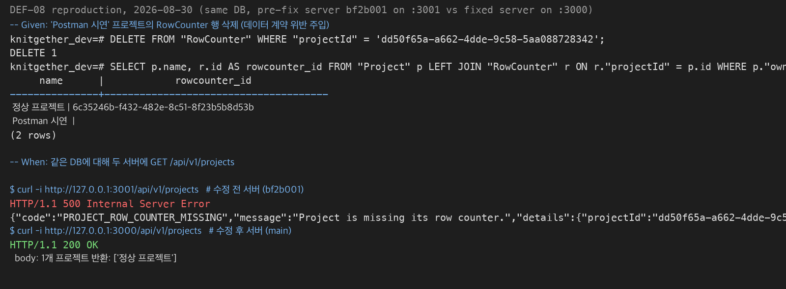
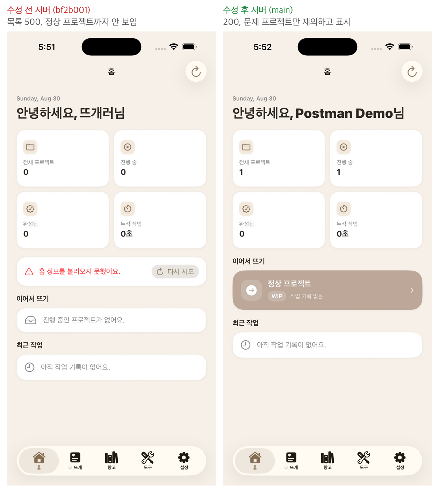
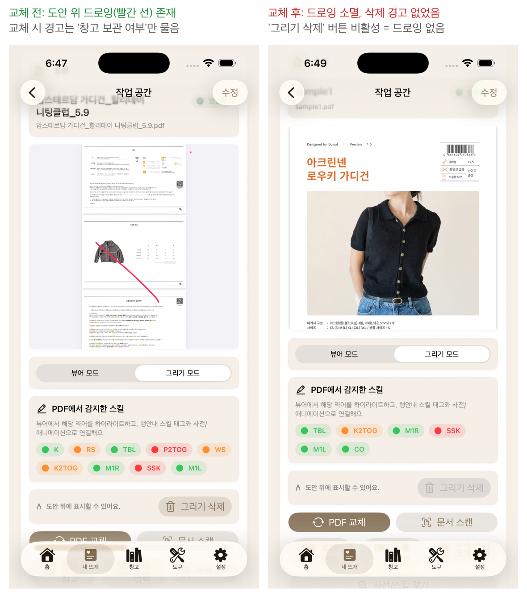
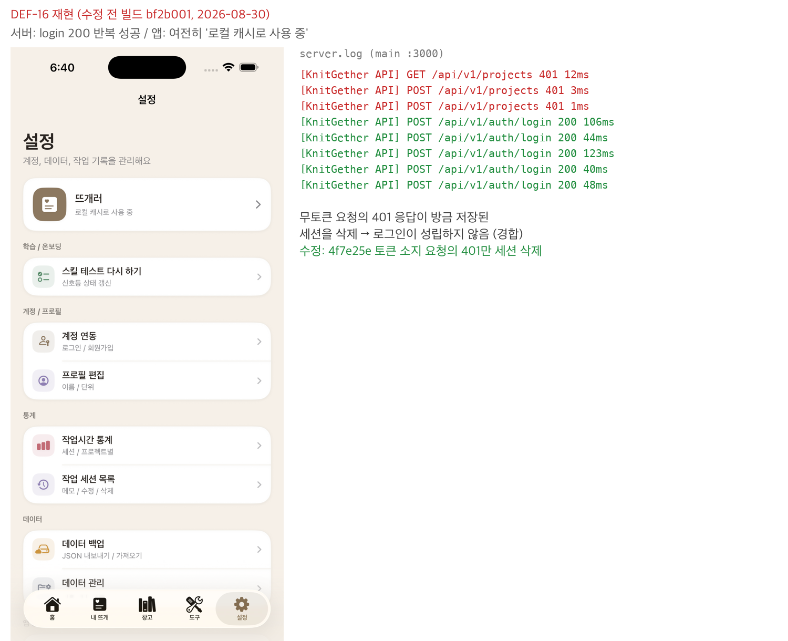

# 10_결함 카탈로그

> 2026-09-18 재작성. 결함 ID, 제목, 결함 클래스, 심각도 판정, 발견 경위는 원본(`docs/qa/portfolio/10`, 2026-09-06 갱신분까지)에서 옮겼다. 상태는 2026-09-18 GitHub Issue 기준으로 적었고, 원본 대장의 상태 열도 2026-09-19에 같은 기준으로 고쳤다. 2026-09-19에 원본 9/15 갱신분(#14 잔존 2건, DEF-23 재현 불가 확정, 남은 판단 7번과 8번)을 반영했다. 근거는 `docs/qa/fix_cycle_worklog_2026-09-03.md`와 각 이슈의 수정 확인 코멘트다. 8/24 시점의 상태는 6절 이력에 남겼다. 재현 절차 전문, psql 원문, 발견 시각은 06과 그 부록이 정본이다.

#### 이 문서의 위치

ISTQB 4.0 테스트 프로세스의 실행 활동 산출물이다. 실행 중 실제 결과가 기대 결과와 다르면 결함 리포트를 쓰고, 결함 관리 프로세스로 수정과 수정 확인(확인 테스트), 회귀 테스트까지 추적한다. 29119-3에서는 인시던트 리포트에 해당한다. 한 건씩 따로 쓴 리포트가 아니라 결함 전체를 한 대장에 모은 형식이다.

ISTQB가 결함 리포트에 요구하는 항목과 이 문서의 대응이다.

| ISTQB 결함 리포트 항목 | 이 문서에서 보는 곳 |
| --- | --- |
| 식별자, 제목 | 2-1 표의 ID와 제목. DEF-01~29와 SPEC-PROJ-01 |
| 발견 맥락 (시점, 활동, 테스트 항목) | 1절 발견 시점 분류, 2-1 표의 발견 시점과 발견 경위 |
| 재현 절차 | 2-1 표 발견 경위 열의 TC ID로 06을 찾는다. 주요 결함은 4절에 재현 조건을 적었다 |
| 기대 결과와 실제 결과 | 기대 결과는 TC가 참조하는 02의 SPEC이다. 실제 결과는 제목이 요약하고, 주요 결함은 4절에 둘 다 적었다 |
| 심각도 | 2-1 표와 3절. 04의 정의로 판정했다 |
| 우선순위 | 결함 단위 필드를 두지 않았다. 수정 순서는 5절의 원인 계열 단위로 정했고, 리스크 우선순위는 03이 결함 클래스(RC)에 매긴 등급을 따른다 |
| 상태 | 2-2 표. 30건 모두 수정됐고 이슈가 있는 29건은 모두 닫혔다 |
| 수정 확인과 회귀 | 2-2 표의 수정 커밋, 수정 확인 수단, verified 라벨 |

결함은 원본의 문법대로 "결함 클래스 → 재현 조건 → 검증 방법 → 결과" 순서로 서술한다. 결함 클래스(RC-01~08)는 03의 리스크 레지스터에서 왔다.

#### 1. 발견 시점 분류

00에서 선언한 세 범주(개발 중 발견, 핸드오프 known issue, QA 신규 발견)로 나눈다. 대장에 오른 30건 가운데 개발 중 발견은 없다. 개발 중 발견은 이 대장 밖에 있다. 세 범주는 이슈 번호 구간으로도 갈린다. #1~#7은 6월 기능 개발 이슈, #9~#17은 7/29 핸드오프 시점에 개발 단계에서 남긴 이슈, #18~#39는 QA 대장의 사후 등록분이다.

| 범주 | 세부 경위 | 건수 | 해당 |
| --- | --- | --- | --- |
| QA 신규 발견 | 05 설계 케이스 실행 | 9 | DEF-01~05, 07~10 |
| QA 신규 발견 | 탐색 관찰 (케이스 밖) | 5 | DEF-06, 11, 12, 13, 14 |
| QA 신규 발견 | QA 사이클 중 발생한 회귀 (UX 개편 유발) | 1 | DEF-15 |
| QA 신규 발견 | 2차 자동화 준비 단계 | 4 | DEF-16~19 |
| QA 신규 발견 | 2차 07 API 트랙 | 2 | DEF-20, 22 |
| QA 신규 발견 | 05 설계 케이스 실행, 기록 누락분 | 1 | DEF-21 |
| QA 신규 발견 | 9/1 정적 점검 | 6 | DEF-24~29 |
| 핸드오프 known issue | 실측으로 미수정 확정 | 1 | DEF-23 (핸드오프 이슈 #9) |
| 명세 공백 | 스펙 신설 | 1 | SPEC-PROJ-01 |

DEF-01은 핸드오프 known issue #16의 동작을 실측으로 확정한 것이다. 문서에 적혀 있던 것과 실제로 데이터가 사라지는 것을 확인한 것은 구분하고, 이 대장은 후자를 QA 신규 발견으로 센다. DEF-23은 반대 방향의 정정이다. 9/1에 QA 신규 발견으로 적었다가 핸드오프 이슈 #9가 같은 증상임을 확인하고 핸드오프 known issue로 옮겼다(4절 DEF-23, 6절).

#### 2. 결함 대장

##### 2-1. 식별과 분류

| ID | 제목 | 결함 클래스 | 심각도 | 발견 시점 | 발견 경위 |
| --- | --- | --- | --- | --- | --- |
| DEF-01 | 다중 기기 충돌로 작업 세션 하드 삭제 | RC-01 동기화 유실 | Critical | 8월 초 (06 수동) | TC-SYNC08-01 실행 |
| DEF-02 | 단일 기기 재전송으로 세션 소멸 | RC-01 동기화 유실 | Critical | 8월 초 (06 수동) | TC-SYNC08-02 실행 |
| DEF-03 | 서버 거부 시 localOnly 완전 유실 | RC-01 동기화 유실 | Critical | 8월 초 (06 수동) | TC-SYNC09-01 실행 |
| DEF-04 | pendingUpload 수정본 무통보 폐기 | RC-01 동기화 유실 | Critical | 8월 초 (06 수동) | TC-SYNC10-01 실행 |
| DEF-05 | 계정 전환 시 타 소유자 데이터 노출 | RC-02 계정 격리 | Critical | 8월 초 (06 수동) | TC-AUTH04-01 실행 |
| DEF-06 | 로그아웃 시 익명 영역으로 캐시 유입 | RC-02 계정 격리 | Critical | 8월 초 (탐색 관찰) | DEF-05 조사 중 캐시 폴더 실측 |
| DEF-07 | 타 소유자 프로젝트 화면 표시 (업로드는 격리됨) | RC-02 계정 격리 | Critical | 8월 초 (06 수동) | TC-AUTH05-01 실행 |
| DEF-08 | RowCounter 없는 프로젝트가 목록 전체 500 | RC-04 데이터 계약 | Critical (8/29 판정) | 8월 초 (06 수동) | TC-CNT03-01 실행 |
| DEF-09 | 삭제된 스킬이 로컬 캐시에 잔존 표시 | RC-07 죽은 ID 표시 | Major | 8월 초 (06 수동) | TC-LINK03-01 실행 |
| DEF-10 | 도안 교체 시 확인창 없이 드로잉 삭제 | RC-01 동기화 유실 (8/29 재분류, 원래 RC-03) | Critical (8/29 판정) | 8월 초 (06 수동) | TC-LINK01-01 실행 |
| DEF-11 | 원격 캐시가 서버 삭제 항목을 제거하지 않음 | 캐시 갱신 전략 | Major | 8월 초 (탐색 관찰 31) | psql 삭제 후 잔존 확인 |
| DEF-12 | 자가 치유 중 수정분 폐기와 소멸 무통보 | RC-01 동기화 유실 | Critical | 8월 초 (탐색 관찰 32) | DEF-11 재현 중 관찰 |
| DEF-13 | 창고 경로 도안의 서버 파일 키 부재 | 파일 정합성 (RC-08, 운영 리스크) | 심각도 축 제외 (8/29) | 8월 초 (탐색 관찰) | 07 추적 |
| DEF-14 | 도안 교체 후 서버 드로잉 키 잔존 | 파일 정합성 (RC-08, 운영 리스크) | 심각도 축 제외 (8/29) | 8월 초 (탐색 관찰 37) | psql 키 확인 |
| DEF-15 | 카운터 0에서 감소가 증가로 오동작 | 회귀 (UX 개편 유발) | Major (8/29 판정) | 8월 초 (06 실행 중) | TC-CNT01-01 실행 |
| DEF-16 | 로그인 직후 무관한 401이 새 세션 삭제 (경합) | 세션 정합성 | Critical (8/29 판정) | 8/22~23 (자동화 준비) | 실기기 탐색, 서버 계측 |
| DEF-17 | 작업 세션 저장 시 lastWorkedAt 미갱신 | RC-03 표시 정합성, 데이터 계약 | Major | 8/23 (케이스 설계) | UI-33 설계 중 정렬 관찰, 코드 대조, `projects.json` 실증 |
| DEF-18 | 보기 모드에서 드로잉 미표시 | RC-03 표시 정합성 | Major | 8/23 (케이스 설계) | UI-48 실행 중 관찰 |
| DEF-19 | 탭 복귀 시 도안 페이지 1페이지로 초기화 | RC-03 표시 정합성 | Major (8/29 판정) | 8/23 (케이스 설계) | UI-51 실행 중 관찰 |
| SPEC-PROJ-01 | 프로젝트 이름 길이 제한 미구현 (1~30자 신설) | 명세 공백, 스펙 신설 | 심각도 축 제외 (8/29) | 8/23 (케이스 설계) | UI-17 설계 중 코드 3층 확인 |
| DEF-20 | 저장되지 않은 rowCounter id 참조 시 500 누수 | 검증 공백 | Major (8/30 확정) | 8/29 (07 트랙) | API 원자성 주입 확인 중 발견 |
| DEF-21 | 도안 연결 해제가 서버에 전파되지 않음 | RC-01 동기화 유실 | Critical (8/30 확정) | 8/5 (06 수동, 실기기) | TC-CUJ3-01 실행 중 발견 |
| DEF-22 | 필수 중첩 필드(rowCounter) 누락이 400 대신 500 누수 | 검증 공백 | Major (8/31 확정) | 8/31 (2차 07 API 트랙) | API-07 필수 필드 보강 테스트 작성 중 발견 |
| DEF-23 | 앱 백그라운드 진입 시 작업 세션이 종료되지 않음 | 카운트 부정확 (01 치명도 4위, 03 결함 클래스 없음) | Critical (9/1 확정) | 7/29 핸드오프 known issue (#9). 9/1 코드 대조로 미수정 확인, TIME-02로 스펙화 | f93aacc 대조 중 scenePhase 부재 재확인 |
| DEF-24 | 저장 충돌 안내 문구가 동작과 모순 ("다시 시도" 요구, 수정본은 폐기) | RC-03 표시 정합성 | Minor (9/1 확정) | 9/1 (정적 점검) | f93aacc 낙관적 잠금 대조 |
| DEF-25 | 창고 삭제 고지가 사용 기록 기준, 바늘과 도구는 고지 없음 | RC-03 표시 정합성 | Minor (9/1 확정) | 9/1 (정적 점검) | 기능정의서 정의 없음 14번 승인 중 코드 대조 |
| DEF-26 | 단위 옵션 값 체계가 화면별로 다름 (온보딩 US, 그 외 Imperial) | RC-04 데이터 계약 | Minor (9/1 확정, UI-03 기준) | 9/1 (정적 점검) | 기능정의서 도구, 설정, 홈 작성 중 대조 |
| DEF-27 | 프로필 편집의 표시 이름에 80자 클라 상한 없음 (회원가입엔 있음) | RC-04 데이터 계약 | Minor (9/1 확정) | 9/1 (정적 점검) | AppInputLimit 적용처 전수 확인 |
| DEF-28 | 스킬 테스트 저장 실패 문구가 개발자용 (Xcode 콘솔, 서버 Terminal) | RC-03 표시 정합성 | Minor (9/1 확정) | 9/1 (정적 점검) | 기능정의서 도구 작성 중 대조 |
| DEF-29 | 설정 단위 설명문이 미적용 사실과 어긋남 ("게이지와 길이 입력에서 사용") | RC-03 표시 정합성 | Minor (9/1 확정, UI-03 기준) | 9/1 (정적 점검) | UI-03 신설과 함께 확정 |

##### 2-2. 수정 확인과 상태

상태는 30건 모두 수정 완료다. 이슈가 있는 29건은 모두 닫혔고 DEF-22만 이슈 없이 수정됐다. verified 라벨 유무는 2026-09-18 이슈 기준이다. 라벨이 없는 건은 수정 확인 수단 열에 판정 근거를 적었다.

| ID | 수정 커밋 | 수정 확인과 회귀 | 이슈 | 닫힌 날 | verified |
| --- | --- | --- | --- | --- | --- |
| DEF-01 | `d0a753a` 서버 증분 upsert (8/9) | API-18 | #18 | 8/30 | 있음 |
| DEF-02 | `d0a753a` 계열 | API-18 | #19 | 8/30 | 있음 |
| DEF-03 | `eab799d` conflict 보존 (8/9) | API-19 | #20 | 8/30 | 있음 |
| DEF-04 | conflict 보존 계열 | API-20 | #21 | 8/30 | 있음 |
| DEF-05 | `9ba16c9` 로그아웃 시 계정 저장소 정리 (9/6) | AppRepositoryContainerTests 32 passed. Appium UI-77은 통과하지만 화면 노출만 본다 | #22 | 9/6 | 없음 |
| DEF-06 | `4d76203` 게이트 (8/11), `9ba16c9` 저장소 정리 (9/6) | AppRepositoryContainerTests 32 passed. 수정 사이클(9/3~) 중 UI-77 실행에서 익명 영역 유입 미재현 | #23 | 9/6 | 없음 |
| DEF-07 | `9ba16c9` DEF-05와 같은 계열 (9/6) | AppRepositoryContainerTests 32 passed | #24 | 9/6 | 없음 |
| DEF-08 | `7defe1c` 목록 격리 (8/6) | API-21. 8/30 수정 전후 서버 대조 재현 (4절) | #25 | 8/30 | 있음 |
| DEF-09 | 캐시 프루닝 계열 | API-22 | #26 | 8/30 | 있음 |
| DEF-10 | `8f1a4ad` 네 진입점 확인창 (8/9) | UI-45. 8/30 수정 전 빌드 재현 (4절) | #27 | 8/30 | 있음 |
| DEF-11 | 캐시 스테일 제거 | UI-28 간접 | #28 | 8/30 | 있음 |
| DEF-12 | conflict 보존 계열 | API-20 | #29 | 8/30 | 있음 |
| DEF-13 | `a74945a` (8/11) | API-23, UI-43 | #30 | 8/30 | 있음 |
| DEF-14 | `0109898` 레코드 재생성 (8/9) | API-24 | #31 | 8/30 | 있음 |
| DEF-15 | `3bc32f8` 0에서 감소 가드 (8/6), `34f3c00` 겹침 제거 (8/6) | UI-39, UI-54, CI 게이트 `testDEF15` | #32 | 8/30 | 있음 |
| DEF-16 | `4f7e25e` 토큰 소지 요청만 삭제 (8/23) | UI-08 (증상 감시). 8/30 수정 전 빌드 재현 (4절) | #33 | 8/30 | 있음 |
| DEF-17 | `543ae7f` (8/26) | UI-33, 35, 38 8/29 PASS. API-25 4건 PASS | #34 | 8/30 | 있음 |
| DEF-18 | `d1c6010` (8/26) | UI-49 8/29 PASS | #35 | 8/30 | 있음 |
| DEF-19 | `d1c6010` (8/26) | UI-51 8/29 PASS | #36 | 8/30 | 있음 |
| SPEC-PROJ-01 | `834876f` (8/26) | UI-17 8/29 PASS | #37 | 8/30 | 있음 |
| DEF-20 | `1637acc` 행 지시가 있을 때만 400 (9/3 커밋, 9/5 보고) | `test_05_transaction_atomicity.py::test_unknown_row_counter_id_is_rejected_without_mutation`. 400, 에러 코드, 부모 프로젝트 미변경(psql) 확인 | #38 | 9/6 | 있음 |
| DEF-21 | `e1b25ad` (8/10) | UI-46, TC-CUJ3-01 | #39 | 8/30 | 있음 |
| DEF-22 | `1637acc` `@IsDefined()` 추가 (9/3) | `test_16_coverage_promotions.py::test_api_07_missing_row_counter_is_rejected_without_insert`. 거부의 원자성을 psql로 확인 | 미등록 | 해당 없음 | 해당 없음 |
| DEF-23 | `4dea734` scenePhase 연결 (9/3 커밋, 9/5 보고) | ProjectWorkspaceViewModelTests 80 passed, 그중 `backgroundEndsSessionAndActivationStartsANewOne`. Appium 재현 케이스 두 빌드 대조 (4절). 9/15 짧은 백그라운드 케이스 신설, 원래 증상은 재현 불가 확정 `1362481` | #9 (#40은 중복) | 9/6 | 없음. 6차 회귀(2026-09-18~19)에서 수정 커밋의 테스트 통과, 라벨 부여 대기 |
| DEF-24 | `0335515` 입력 보존과 문구 | ProjectWorkspaceViewModelTests | #41 | 9/6 | 없음. 6차 회귀(2026-09-18~19)에서 수정 커밋의 테스트 통과, 라벨 부여 대기 |
| DEF-25 | `f685bc1` 연결 기준 통일 | library.e2e, LibraryItemViewModelTests | #42 | 9/6 | 없음. 6차 회귀(2026-09-18~19)에서 수정 커밋의 테스트 통과, 라벨 부여 대기 |
| DEF-26 | `52dee72` 단위 선택 제거 | UI-01, OnboardingViewModelTests | #43 | 9/6 | 없음. 6차 회귀(2026-09-18~19)에서 수정 커밋의 테스트 통과, 라벨 부여 대기 |
| DEF-27 | `982d858` 80자 상한 (9/5) | 전용 케이스 없음. 커밋 검증은 빌드 통과 | #44 | 9/6 | 없음. 검증 근거 없음 |
| DEF-28 | `982d858` 문구 교체 (9/5) | 전용 케이스 없음. 커밋 검증은 빌드 통과 | #45 | 9/6 | 없음. 검증 근거 없음 |
| DEF-29 | `52dee72` 단위 선택 제거, `c40836d` 메뉴 부제 | UI-01, 시뮬레이터 확인 | #46 | 9/6 | 없음. 6차 회귀(2026-09-18~19)에서 수정 커밋의 테스트 통과, 라벨 부여 대기 |

수정 커밋 열의 8월 해시는 2026-08-27에 리포지토리에서 전건 실재를 확인했다. **커밋이 존재한다는 사실이지 회귀 검증이 끝났다는 판정이 아니다.** 회귀 판정은 수정 확인 열의 케이스를 실행해야 나온다.

DEF-05~07에 verified 라벨이 없는 이유는 판정 수단이 바뀌었기 때문이다. 원래 계획은 Appium UI-77로 로그아웃 후 디스크에서 계정 폴더가 사라지는지 보는 것이었다. Appium이 앱을 재설치하면 데이터 컨테이너가 새로 만들어져 감시하던 경로가 통째로 사라진다. UI-77 자체는 통과하지만 화면 노출만 보므로 디스크가 지워졌는지는 말해 주지 않는다. 디스크 판정은 단위 테스트 AppRepositoryContainerTests(32 passed)가 맡았다. 단위 케이스는 로그아웃한 계정 폴더가 사라지는지와 다른 계정 폴더는 남는지를 함께 본다. 뒤 조건이 없으면 전부 지우는 구현도 통과한다(#22~#24 코멘트, fix_cycle 워크로그 5-8절).

DEF-23과 DEF-24~29도 verified 라벨이 없다. 닫는 코멘트에 수정 커밋과 검증 결과(빌드 통과, 단위 테스트 통과 건수, UI-01)는 있으나 라벨은 붙지 않았다. DEF-23, 24, 25, 26, 29는 6차 회귀(2026-09-18~19)에서 수정 커밋의 테스트가 통과해 라벨 부여 대기다. DEF-27, 28(`982d858`)은 수정 커밋에 테스트가 없어 검증 근거가 없다. DEF-22는 이슈로 등록되지 않은 채 수정됐다.

#### 3. 심각도 판정

04의 정의를 그대로 적용했다.

> Critical(데이터 유실, 계정 간 노출과 오염, 앱 사용 불가), Major(기능 실패, 정합성 표시 오류), Minor(안내 문구, 사용성). CUJ 도중 발생한 결함은 한 단계 상향한다.

전체 집계다(2026-09-02 기준, 대장 직접 집계). 이후 심각도가 바뀐 건은 없다.

| 심각도 | 건수 | 해당 |
| --- | --- | --- |
| Critical | 13 | DEF-01~08, 10, 12, 16, 21, 23 |
| Major | 8 | DEF-09, 11, 15, 17~20, 22 |
| Minor | 6 | DEF-24~29 |
| 심각도 축 제외 | 3 | DEF-13, 14, SPEC-PROJ-01 |

##### 3-1. 8/29 판정 (20건)

8/29 판정 시점의 대상은 20건이었다. 그중 12건은 위 정의를 읽으면 바로 등급이 떨어졌다. Critical 8건(DEF-01~07, 12)은 데이터 유실 5건과 계정 간 노출과 오염 3건이고, Major 4건(DEF-09, 11, 17, 18)은 정합성 표시 오류다.

나머지 8건은 04 문구가 두 등급 어느 쪽으로도 읽히거나 심각도 축 자체가 정의되지 않은 항목이라 QA(유하은)가 개별로 정했다. 판정 당시 CUJ 번호는 9/1 재분류 전이다. 당시 CUJ-4(모르는 기술 만남)가 지금의 CUJ-3이다.

| ID | 무엇이 갈리는가 | 판정 |
| --- | --- | --- |
| DEF-08 | 프로젝트 목록은 CUJ-1, 2의 진입점이다. 프로젝트 하나 때문에 목록 전체가 막히면 다른 프로젝트도 진입할 수 없어 앱 사용 불가에 해당한다 | Critical |
| DEF-10 | 사용자가 그린 드로잉이 경고 없이 사라지므로 데이터 유실이다. 분류가 틀렸던 것이라 RC-01로 재분류했다 | Critical |
| DEF-13 | 03에서 RC-08을 치명도 축 밖 운영 리스크로 빼서 07로 이관한 결정을 유지한다. 대장에서 뒤집으면 문서끼리 어긋난다 | 제외 |
| DEF-14 | DEF-13과 같다 | 제외 |
| DEF-15 | 기능 실패라 기본은 Major다. 당시 CUJ-1, 2, 4에 카운터가 들어 있지만 여정의 정상 경로는 증가와 보존이고 0에서 감소는 여정 밖 입력이다. 한 번 더 누르면 되돌아가고 데이터 유실도 없어 여정을 끊지 않으므로 상향하지 않는다 | Major |
| DEF-16 | 기본은 재로그인으로 회복되는 기능 실패(Major)다. 로그인은 CUJ-1, 2의 정상 경로 첫 단계이고 세션이 지워지면 그 순간 앱 사용 불가가 된다. 상향 조건(사용 불가)을 충족한다 | Critical |
| DEF-19 | 당시 CUJ-4가 "복귀 후 도안 페이지 번호 보존"을 성공 기준으로 명시하므로 표시 정합성 오류(Major)다. CUJ 안이지만 회복 가능한 위치 손실이라 개정 규칙에 따라 올리지 않는다 | Major (04 규칙 개정) |
| SPEC-PROJ-01 | 결함이 아니라 명세 공백이고 스펙을 신설한 건이라 심각도 축에서 뺀다. 결함 집계에서도 스펙 신설 1건으로 따로 센다 | 제외 |

상향 규칙은 04에서 개정했다. Major를 Critical로 올리는 것은 결과가 유실, 노출, 사용 불가일 때만이다. 판정 기준이 되는 CUJ는 9/1 재분류로 3개(첫 사용, 재방문 작업 재개, 모르는 기술 만남)다. 연결의 생애주기는 CUJ가 아니라 정합성 심층 검증으로 옮겼으므로 상향 판정에서 CUJ 안으로 세지 않는다. 이 변경이 기존 판정을 뒤집지는 않는다. DEF-21(연결 해제 미전파)은 CUJ 상향이 아니라 데이터 유실 그 자체로 Critical이다.

##### 3-2. 8/30 이후 판정

| ID | 판단 | 심각도 |
| --- | --- | --- |
| DEF-20 | 저장이 실패하므로 04 정의의 기능 실패다. 트랜잭션이 롤백되어 데이터는 온전하지만 사용자가 의도한 저장이 이뤄지지 않고 처리 가능한 안내도 받지 못하므로 Minor로 내리지 않는다. 유실, 노출, 사용 불가가 아니어서 Critical 대상도 아니다 | Major (8/30) |
| DEF-22 | DEF-20과 같은 논리다. 롤백으로 데이터는 온전하고, DEF-08처럼 다른 프로젝트까지 막지 않는다. iOS 클라이언트는 `rowCounter`를 항상 채워 보내는 구조라 정상 클라이언트가 이 경로를 밟을 가능성은 낮지만 계약이 깨져 있다는 사실은 남는다 | Major (8/31) |
| DEF-23 | 백그라운드로 보낸 뒤 복귀해 화면을 나가면 그 기간이 세션으로 기록된다(4시간 절단만 걸림). 01의 제품 보장 "누른 만큼 정확히 센다"와 TIME-01 "실제 작업하지 않은 구간 미포함"을 정면으로 깬다. 유실이 아니라 과다 기록이지만 통계와 누적 시간의 신뢰가 무너지는 점은 유실과 같아 기본 Major에서 상향했다 | Critical (하은 판정) |
| DEF-24 | 문구 문제. 수정본 폐기 자체는 SYNC-11 v2.2에서 스펙으로 확정됐으므로 유실이 아니다 | Minor |
| DEF-25 | 고지 누락. 삭제해도 스냅샷은 남아(LINK-04) 데이터 영향이 없다 | Minor |
| DEF-26 | UI-03이 값을 계산에 쓰지 않는다고 확정했으므로 영향은 프로필 편집 픽커의 빈 선택 표시에 그친다. 값이 계산에 쓰였다면 Major였다 | Minor |
| DEF-27 | 서버가 400으로 막아 저장되지 않는다. 안내 부족이다 | Minor |
| DEF-28 | 안내 문구 | Minor |
| DEF-29 | 안내 문구 | Minor |

DEF-23~29의 9/1 방법은 정적 테스트(코드 대조)였고 등록 시점에 실행 재현은 없었다. 대조 근거는 `docs/spec/spec_drift_f93aacc.md` 6절과 `docs/spec/기능정의서_도구_설정_홈.md` 불일치 목록이다. 이슈 #41~#46은 발견과 같은 날인 9/1에 등록해 사후 등록이 아니다.

#### 4. 주요 결함 리포트

심각도 판정에 논쟁이 있었거나 수정 확인이 단순하지 않았던 건만 리포트 형식으로 풀었다.

##### DEF-08 (RC-04, Critical)

| 항목 | 내용 |
| --- | --- |
| 결함 클래스 | RC-04 데이터 계약 불일치. 서버는 RowCounter가 옵셔널, 클라이언트는 필수값 |
| 재현 조건 | psql로 한 프로젝트의 `RowCounter` 행을 지운 뒤 `GET /projects` |
| 기대 결과 | 프로젝트 하나의 문제로 목록 전체가 막히지 않는다 |
| 실제 결과 | 수정 전 서버(bf2b001, 3001 포트)가 `500 PROJECT_ROW_COUNTER_MISSING`으로 목록 전체를 실패시킨다. 앱 홈이 "불러오지 못했어요"로 멈추고 정상 프로젝트까지 사라진다 |
| 검증 방법 | 2026-08-30 같은 DB에 수정 전후 서버를 나란히 붙여 대조 |
| 결과 | 수정 후 서버(main, 3000 포트)는 `200`에 해당 프로젝트만 제외하고 서버 로그에 `Skipped project`를 남긴다. 상향 조건 "앱 사용 불가"의 실제 모습이 수정 전 화면이다 |

##### DEF-10 (RC-01, Critical)

| 항목 | 내용 |
| --- | --- |
| 결함 클래스 | RC-01 동기화 유실. 원래 RC-03 표시 정합성으로 분류했다가 8/29 재분류 |
| 재현 조건 | 2026-08-30 bf2b001 재빌드. 도안 위에 드로잉을 남기고 PDF 교체 실행 |
| 기대 결과 | 드로잉이 삭제된다면 사용자에게 먼저 알린다 |
| 실제 결과 | 옛 도안의 창고 보관 여부는 묻지만 드로잉 삭제 경고는 없고, 교체 후 드로잉이 사라져 있다 |
| 검증 방법 | 수정 전 빌드 수동 재현, 수정 후 UI-45 회귀 |
| 결과 | 무경고 유실을 확인해 RC-01 재분류의 근거로 삼았다. 수정(`8f1a4ad`)은 네 진입점 모두에 드로잉 삭제 확인창을 추가했다 |

##### DEF-16 (세션 정합성, Critical)

| 항목 | 내용 |
| --- | --- |
| 결함 클래스 | 세션 정합성. 8월 실기기 탐색에서는 간헐 경합 |
| 재현 조건 | 2026-08-30 bf2b001 재빌드에서 로그인 |
| 실제 결과 | 서버 로그에 login 200이 반복해서 남는데 앱 설정은 계속 "로컬 캐시로 사용 중"이다. 로그인 직후 큐에 있던 무토큰 요청들이 401을 받고, 그 401 처리기가 방금 저장된 세션을 삭제한다 |
| 검증 방법 | 서버 계측 로그(요청별 Authorization 헤더 기록), 수정 전 빌드 재현 |
| 결과 | 이 환경에서는 상시 재현됐다. 수정(`4f7e25e`)은 토큰을 소지한 요청의 401만 세션을 삭제하게 바꿨고, UI-08이 증상을 감시한다 |

첫 조사에서는 다중 서버 탓으로 닫았다가 재발 보고를 받고 재수사해 확정했다. 간헐 재현은 결함 없음이 아니라 아직 조건을 못 찾았다는 뜻이다(8절).

##### DEF-20 (검증 공백, Major)

| 항목 | 내용 |
| --- | --- |
| 결함 클래스 | 검증 공백 |
| 재현 조건 | 기존 프로젝트에 새 `rowCounter.id`를 보내면서 행 지시를 함께 보낸다 |
| 기대 결과 | 처리 가능한 4xx |
| 실제 결과 | 500. 행 지시 없음은 200, 카운터 id 유지와 행 지시는 200, 새 id와 행 지시는 500 |
| 원인 | 서버는 카운터를 프로젝트당 1:1로 유지해 새 id를 저장하지 않는데, 행 지시가 그 저장되지 않은 id를 참조해 외래키가 터진다(`RowInstruction_rowCounterId_fkey`, Prisma P2003). 기존 `ROW_COUNTER_NOT_FOUND` 가드는 지시의 id와 본문의 id가 같은지만 보고 저장된 id와는 대조하지 않았다 |
| 검증 방법 | 수정 전에는 `test_unknown_row_counter_id_leaks_500`이 500을 고정했다. 수정 후 이 단언을 뒤집었다 |
| 결과 | `1637acc`가 행 지시가 있을 때만 400으로 거부한다. 새 id, 행 지시 없음은 200을 유지한다 |

발견 경위는 결함을 찾으러 간 것이 아니다. 전체 API 스위트를 처음 통합 실행하다 원자성 테스트가 실패했고, 그 주입이 실제로 작동하는지 확인하다 드러났다.

가드 범위는 측정으로 정했다. id 불일치 자체를 막는 넓은 가드로 먼저 구현했더니 회귀 감시 7건이 깨졌고, 그중 2건이 DEF-01 회귀 감시(`test_11_sync_loss_regression`)였다. 로컬 id가 어긋난 기기는 저장이 영구히 400이 되고 앱은 서버 거부를 SYNC-10대로 무통보 폐기한다. Major 한 건을 고치려고 유실 경로를 여는 교환이 되어 넓은 가드를 택하지 않았다(fix_cycle 워크로그 2절).

##### DEF-21 (RC-01, Critical)

| 항목 | 내용 |
| --- | --- |
| 결함 클래스 | RC-01 동기화 유실 |
| 재현 조건 | 8/5 실기기 TC-CUJ3-01. 확인창에서 도안 연결 해제 선택 |
| 기대 결과 | 해제가 서버에 전파된다 |
| 실제 결과 | 화면이 반쪽 상태(PDF 없음 문구와 연결됨 표기 공존)가 되고 재진입 시 연결이 복원된다. psql 실측으로 `ProjectPatternCopy`가 서버에 `deletedAt` 없이 잔존한다 |
| 원인 | Swift `JSONEncoder`가 nil을 필드 생략으로 인코딩해 해제 신호가 서버에 undefined(no-op)로 도착했다. 서버의 null 제거 분기는 이미 있었다 |
| 결과 | `e1b25ad`(8/10)가 명시적 null 인코딩으로 해제를 전파한다. 사용자가 해제한 연결이 되살아나 의도한 상태 변경이 무이력으로 소실되므로 Critical이다 |

이 결함은 8/5에 발견되고 8/10에 수정됐는데 대장에 오르지 않았다. 노션 관찰 로그는 자체 번호(결함 18)를 쓰고 대장은 DEF 번호를 쓰는데, 8/27 리포지토리 이관 때 두 체계를 대조하지 않았다. 노션의 결함 19는 DEF-13으로 옮겨졌으나 결함 18은 어느 DEF에도 대응하지 않았다. TC-CUJ3-01의 FAIL 사유이기도 해서, 결함 하나가 빠진 것이 아니라 TC 판정 하나의 근거가 통째로 비어 있는 상태였다. 원본 11의 3절이 "집계상 FAIL 1건의 근거가 어느 문서에도 남아 있지 않다"고 적은 것이 이 누락이고, 8/30에 복원했다. 노션 로그의 자체 번호 전건을 DEF 번호와 대조하는 작업은 남아 있다.

##### DEF-22 (검증 공백, Major)

| 항목 | 내용 |
| --- | --- |
| 결함 클래스 | 검증 공백 |
| 재현 조건 | `SaveProjectDto`에서 `rowCounter` 키를 빼고 `POST /projects` |
| 기대 결과 | API-07 판정 기준대로 필수 필드 누락은 400 |
| 실제 결과 | 500. 같은 요청에서 `name`을 빼면 400이다. 필드 종류에 따라 처리가 갈린다 |
| 원인 | `rowCounter`에 `@ValidateNested()`만 있고 `@IsDefined()`가 없었다. class-validator는 값이 undefined면 중첩 검증을 건너뛰고, 통과한 뒤 `saveProjectChildren`이 `body.rowCounter.id`를 역참조해 TypeError로 크래시한다 |
| 검증 방법 | 수정 전에는 `test_api_07_missing_row_counter_leaks_500_not_400`이 500을 고정했다. 수정 후 이 단언을 뒤집고 거부의 원자성을 psql로 함께 본다 |
| 결과 | `1637acc`가 `@IsDefined()`를 추가해 400으로 닫았다 |

##### DEF-05, 06, 07 (RC-02, Critical)

| 항목 | 내용 |
| --- | --- |
| 결함 클래스 | RC-02 계정 격리 실패 |
| 재현 조건 | 계정 전환(TC-AUTH04-01), 로그아웃 후 캐시 폴더 실측, 타 소유자 프로젝트 표시(TC-AUTH05-01) |
| 1차 조치 | `4d76203`(8/11) AUTH-06 게이트가 화면 노출만 막았다. 저장 구조는 그대로라 8/30 이슈 등록 때 셋 다 열린 상태로 남았다 |
| 중간 확인 | 수정 사이클(9/3~) 중 UI-77을 최신 빌드로 돌린 결과 `anonymous` 디렉토리가 생기지 않았다. DEF-06의 익명 영역 유입은 재현되지 않았고, 남은 것은 로그아웃 후 이전 계정 캐시가 디스크에 남는다는 사실이었다 |
| 수정 | `9ba16c9`(9/6). 계정 폴더는 순수 캐시가 아니라 offline-first 로컬 저장소라 아직 올리지 못한 항목의 유일한 원본이 있다. 로그아웃 시 미동기화 항목 업로드를 먼저 시도하고, 남은 것이 없으면 세션과 계정 폴더를 지우고, 남으면 개수를 알리고 사용자가 정하게 한다 |
| 검증 방법 | AppRepositoryContainerTests. 로그아웃 계정 폴더 삭제와 다른 계정 폴더 보존을 함께 본다. 서버 주소를 모를 때 아무것도 지우지 않는 것도 확인한다 |
| 결과 | 32 passed. 계정 격리(치명도 3위)를 고치면서 데이터 유실(1위)을 여는 교환을 피했다. DEF-20 가드에서 한 번 걸렀던 것과 같은 형태의 판단이다 |

##### DEF-23 (핸드오프 known issue, Critical)

| 항목 | 내용 |
| --- | --- |
| 결함 클래스 | 카운트 부정확 (01 치명도 4위). 03의 결함 클래스에는 대응 항목이 없다. 원본의 "RC-04" 표기는 03의 RC-04(데이터 계약 불일치)와 맞지 않아 2026-09-19에 정정했다 |
| 재현 조건 | 작업 공간 진입 → Cmd+Shift+H → 1분 대기 → 복귀 → 이탈 |
| 기대 결과 | 홈 이동 시점에 종료된 10초 이상 세션 1건 (TIME-02) |
| 실제 결과 (9/1 코드 대조) | 세션 종료 지점이 `ProjectWorkspaceView.swift:428` `onDisappear` 하나뿐이고 앱 타깃 전체에 `scenePhase` 참조가 없다 |
| 검증 방법 | `4dea734` 후 단위 테스트, 그리고 위 절차를 Appium `background_app`으로 자동화한 `test_def23_background_session.py`(UI 번호 미배정)로 두 빌드 대조 |
| 결과 | 수정 후 `4dea734`는 PASS로 백그라운드 65초가 빠진 세션 하나가 저장된다. 수정 전 `efae837`은 FAIL인데 과다 기록이 아니라 세션 소멸로 실패했다. 65초 백그라운드에서 iOS가 앱을 정지시켜 메모리의 시작 시각이 사라졌고, 이것은 DEF-23과 분리해 둔 명세 공백(02의 4번, 강제 종료 시 세션 소멸)이다 |

닫은 근거는 재현 실패가 아니다. 재현 실패는 정말 고쳐진 경우와 재현 조건을 못 맞춘 경우 둘 다와 양립한다. 이 건은 코드에 백그라운드 종료 처리가 있고 `backgroundEndsSessionAndActivationStartsANewOne`이 그 동작을 고정한다. 이 케이스는 백그라운드 진입 후 추적 중지, 저장된 세션의 `endedAt`이 백그라운드 시점, 복귀 시 경과 0인 새 세션 시작을 본다. 마지막 조건이 없으면 세션을 이어 붙이는 구현도 통과한다(#9 닫는 코멘트). 원래 증상인 4시간 미만 방치의 과다 기록은 이 사이클에서 재현된 적이 없다.

2026-09-15에 세 번째로 시도했다(`1362481`). 65초 케이스가 과다 기록 대신 세션 소멸로 실패한 것이 iOS의 앱 정지 때문이었으므로 정지 전에 돌아오는 8초 케이스를 만들었다. 수정 전 빌드에서 이 케이스도 세션 소멸로 실패했다. 그런데 대조군을 돌려 보니 수정 전 빌드는 백그라운드를 거치지 않아도 세션을 저장하지 않았다. 그러면 앞의 두 실패는 백그라운드 때문이 아니므로 아무것도 말해 주지 않는다. 오래된 빌드에 현재 케이스를 돌리면 결함이 아니라 세대 차이를 재게 된다. 세 번 시도했고 세 번 다 다른 것을 봤다. 원래 증상인 과다 기록은 재현 불가로 확정했다. 대조군이 없었다면 "수정 전에서 실패했으니 검출력이 있다"고 잘못 결론 냈을 것이다.

현재 빌드에서는 65초와 8초 두 케이스가 모두 통과한다. 8초 케이스는 실패하는 것을 본 적이 없어 검출력이 확인되지 않았다(7절).

처음 작성한 판정은 화면 이탈 후 3초만 기다리고 세션을 조회했다. 그러면 업로드가 아직 안 된 경우와 길이가 틀린 경우를 구분하지 못한다. 세션이 올라올 때까지 30초 폴링한 뒤 길이를 판정하도록 고친 뒤에야 위 결과가 드러났다.

#### 5. 원인 계열

06의 핵심 발견이다. FAIL 10건은 개별 화면 버그의 나열이 아니라 몇 개의 뿌리에서 파생됐다. 수정 범위와 우선순위는 개별 결함이 아니라 이 뿌리 단위로 정했다.

| 뿌리 | 결함 | 무엇이 같은가 |
| --- | --- | --- |
| 원격 캐시 갱신 시 제거 없이 병합만 함 | DEF-05, 09, 11 | 서버에서 사라진 것이 로컬에 남는다. 계정 유입, 죽은 스킬, 유령 프로젝트가 같은 전략 결함의 표면이다 |
| 서버 거부 시 무통보 폐기 | DEF-03, 04, 12 | 거부 응답이 로컬 데이터의 삭제나 덮어쓰기를 유발하고 사용자에게 알리지 않는다 |
| 레코드 하드 삭제 (deletedAt 마킹 부재) | DEF-01, 02, RC-08 파일 고아화 | 자식 레코드를 tombstone 없이 물리 삭제한다. 서버 파일 키까지 함께 소멸해 회수 경로가 사라진다 |
| 화면 상태가 뷰 인스턴스에만 존재 | DEF-18, 19 | 드로잉 캔버스와 PDF 페이지 위치가 뷰모델이나 저장소에 없어 뷰 재생성 시 사라진다 |

9/6 수정에서도 표면 아래의 뿌리가 나왔다.

| 결함 | 표면 | 실제 뿌리 |
| --- | --- | --- |
| DEF-26, 29 | 값 체계 불일치, 설명문 오류 | 단위 선택을 읽는 코드가 앱에 없다. 무엇을 골라도 동작이 같았다. 선택 자체를 지우자 두 건이 함께 닫혔다 |
| DEF-24 | 문구가 동작과 모순 | 저장 실패 안내가 후속 조회에 지워져 아예 뜨지 않았다 |
| DEF-25 | 실만 고지 | 연결 역방향 조회가 서버에 없었다 |

DEF-24가 가장 컸다. 문구를 고치러 들어갔는데 `saveMemo`가 `persist` 뒤에 부르는 `loadRelatedSkills`가 성공 시 `errorMessage`를 nil로 되돌리고 있었다. 저장이 충돌로 실패해도 사용자에게 아무 안내가 뜨지 않았다. 사용자는 저장된 줄 알므로 문구가 모순인 것보다 나쁘다. 같은 함정이 `attachPatternFromLibrary`에도 있었다.

#### 6. 상태 이력

| 시점 | 무슨 일 | 상태 |
| --- | --- | --- |
| 8/24 | 구글시트 결함 대장 최종 갱신 | DEF-17~19 미수정, SPEC-PROJ-01 미구현, 나머지 수정 완료 |
| 8/26 | DEF-17~19, SPEC-PROJ-01 수정 커밋 (`543ae7f`, `d1c6010`, `834876f`) | 시트 미반영 |
| 8/29 | 8/26 수정 4건 회귀 재판정 | UI 회귀 6건 전건 PASS, API-25 4건 PASS |
| 8/30 | GitHub Issue 22건 사후 등록 (#18~#39) | closed 18, open 4 (DEF-05, 06, 07 부분 수정 잔존, DEF-20 미수정) |
| 9/1 | DEF-23~29 등록 (#40~#46) | #40은 #9와 중복으로 정정 |
| 9/5 | `1637acc` (DEF-20, 22), `4dea734` (DEF-23), `982d858` (DEF-27, 28) 수정 보고 | 이슈는 열린 채 QA 확인 대기 |
| 9/6 | `9ba16c9` (DEF-05~07), `0335515`, `f685bc1`, `52dee72`, `c40836d` 수정. 열린 이슈 24건 일괄 정리 | 열린 이슈 0건 |
| 9/15 | 15 릴리즈 판정 중 #14 잔존 2건 수정(`3d76cb7` 클라이언트, `5582c3b` 서버). DEF-23 재현 불가 확정(`1362481`). AUTH-08 구현(`2624a43`, 02 명세 공백 6번 승격) | 열린 이슈 0건. 대장 30건, 새 번호 없음. 15 판정 Go |

8/29 재판정이 성립한 이유는 회귀 케이스가 `xfail(strict=True)`로 묶여 있었기 때문이다. 결함이 그대로면 실패로 찍히고, 고쳐지면 XPASS로 터져 마커를 떼라고 알린다. 8/26 수정 이후 마커를 제거했고 스위트에 xfail은 0개다. 실행 근거는 8/29 분할 실행 3회(정방향 2회, 역순 1회)이며 세 회차 모두 79 passed, 1 skipped, 0 failed였다. API-25(`qa/api-tests/test_07_last_worked_at.py`)는 psql로 DB 실제값까지 대조해 DEF-17의 회귀 판정을 클라이언트와 서버 양쪽에서 끝냈다.

8/30 등록분은 사후 등록이다. 생성 시각이 전부 8/30이고 실제 발견은 8/4~8/29였다. 사이클 중 추적은 구글시트 결함 대장과 이 문서로 했고 이슈 트래커는 쓰지 않았다. 04 종료 기준의 "발견 결함 전건 GitHub Issue 등록"을 충족시키려 한 것이고, 각 이슈 본문 첫 줄에 사후 등록임을 적었다. 없던 추적 이력을 만든 것이 아니라 이미 있는 기록을 옮긴 것이지만 타임스탬프만 보면 구분되지 않는다. 종료 기준을 세울 때 1인 사이클에서 실제로 운용할 도구인지 검증하지 않은 것이 원인이다. 등록 과정에서 판정 오류도 한 건 있었다. DEF-20을 수정 커밋 열의 값으로 자동 판정하다 그 칸의 "미수정"을 커밋으로 오인해 닫았고, 확인 후 다시 열고 정정 코멘트를 남겼다(#38).

9/1 등록 직후 핸드오프 이슈 #9가 DEF-23과 같은 증상임을 확인했다. 02 부록 2가 핸드오프 known issue 가운데 #14, #16만 옮겨 두어 대조 범위가 좁았던 것이 원인이다. #40을 중복으로 정정하고 DEF-23의 이슈를 #9로 잡았다. 같은 실수를 막으려면 02 부록 2에 핸드오프 이슈 #9~#17 전건을 올려야 한다.

9/15의 #14 잔존 2건에는 새 번호를 붙이지 않았다. 별개 결함이 아니라 #14의 실제 범위였고, 따로 세면 같은 사건을 두 번 센다. 둘 다 15의 릴리즈 판정을 쓰다가 나왔다. 경위는 15의 6절에 있다.

원본 10의 4-2절 이슈 현황 표(closed 18, open 4)는 2026-08-30 등록 직후 상태이며 원본에서도 갱신하지 않는다. 이후 상태는 이 절과 2-2 표가 정본이다.

9/6에 닫은 24건의 구성은 수정 6건, 이미 해소 2건, 중복 1건, 개발 시절 잔재 7건, 이날 새로 고친 8건이다. 사이클 최종 실행 결과는 서버 e2e 139 passed, API 계약 56 passed, 앱 단위 335 passed, Appium UI 78 passed에 진짜 회귀 0건이다(fix_cycle 워크로그 5-9절).

#### 7. 닫힌 뒤에도 남은 간격

이슈가 모두 닫힌 것과 계약 공백이 모두 사라진 것은 다르다. 원본과 워크로그가 알려진 간격으로 남긴 것들이다.

| 간격 | 내용 | 출처 |
| --- | --- | --- |
| DEF-17 서버 방어 없음 | 서버는 워크세션에서 lastWorkedAt을 파생하지 않고 클라이언트 값을 그대로 저장한다. 수정이 클라이언트에만 있어 다른 클라이언트가 값을 비워 보내면 같은 증상이 재현된다. API-25의 네 번째 테스트가 기록용으로 고정한다 | 원본 10 2-2절 |
| #14 낙관적 잠금 범위 | 해소(2026-09-15). 9/6 시점에는 `baseUpdatedAt` 필수화를 PATCH 경로에만 적용했다. DTO 전체를 필수로 바꾸면 서버 e2e 10 failed, API 계약 32 failed에 프로젝트 생성이 불가능했고, 경로별 판정은 2 failed, 8 failed에 생성 정상이었다. POST 업서트는 last-write-wins로 남았다. 9/15에 충돌 항목의 재수정이 POST로 나가던 클라이언트 경로(`3d76cb7`)와 기존 id에 대한 서버 POST 업서트(`5582c3b`, 409 `PROJECT_ALREADY_EXISTS`)를 닫았다 | 원본 10 7-2절, 원본 15 6절 |
| DEF-23 원래 증상 | 재현 불가 확정(2026-09-15, `1362481`). 짧은 백그라운드(8초) 케이스를 신설했으나 실패하는 것을 본 적이 없어 검출력이 확인되지 않았다. 수정 전 빌드는 대조군에서 백그라운드 없이도 세션을 저장하지 않아 실험이 성립하지 않았다. 확인하려면 현재 빌드에서 백그라운드 처리만 되돌린 변형이 필요하고 13의 뮤테이션 6종과 같은 절차다. 케이스 수가 는 것과 검출력이 는 것은 다르다 | 원본 10 5절 8번, 원본 15 6절 |
| 0초 세션 거부 | `f93aacc`가 `endedAt <= startedAt`을 거부해 이슈 #15 범위(시간 역전)를 넘어 0초 세션도 막는다. 의도한 계약인지는 판정되지 않았다 | fix_cycle 워크로그 1-1절 |
| DEF-28 범위 | 같은 계열 문구가 `AuthAccountViewModel` 다섯 곳에 더 있다. 개발자 본인의 진단에 쓰이고 있어 함께 고치지 않았다 | fix_cycle 워크로그 5-3절 |

#### 8. 실패를 결함으로 올리기 전에

원본에 초안으로 남긴 판정 기준이다. 하은이 확정할 항목(8-4)이 남아 있다. 테스트가 실패했다는 사실만으로 결함을 등록하지 않는다. 이 사이클에서 실패의 원인이 앱이 아니었던 경우가 결함으로 확정된 경우 못지않게 많았다.

| 실패의 원인 | 실제 사례 | 앱 |
| --- | --- | --- |
| 제품 결함 | DEF-01~05, 08, 10, 15, 17~19 | 잘못됨 |
| 테스트 자체의 결함 | 개발 단계 번호 DEF-006, DEF-009, AI 단위 테스트 함정, DerivedData 알파벳순 선택 | 정상 |
| 인프라 실패 | fullReset의 시뮬레이터 erase, Appium 세션 선점, destination 지정 함정 | 정상 |
| 도구 사용 실수 | 노션 결함 33 (Charles 편집 시 따옴표 잔존) | 정상 |
| 간헐 재현으로 인한 오판 | DEF-16 (다중 서버 탓으로 닫았다가 재수사) | 잘못됨 |

DEF-006과 DEF-009는 7월 개발 단계의 세 자리 번호로, 이 대장의 DEF-06, 09와 다른 체계다. 가장 비쌌던 것은 DEF-006이다. 증상은 앱 문제로 보였고(세션 소멸, 탭바 미표시) 여섯 시간을 앱 내부 경쟁 상태와 인증 타이밍을 쫓는 데 썼다. 실제 원인은 POM이 좌표를 맹목적으로 탭해 로그아웃 버튼을 누른 것이었다. 프로덕션에는 좌표 자동 탭이 없으므로 그 버그는 앱에 존재하지 않았다.

##### 8-1. 1단계, 어느 통인가

순서대로 묻고 처음 "예"가 나오면 멈춘다. 몇 분 안에 끝나는 검사만 넣었다. 1단계를 건너뛰고 원인 특정으로 가면 엉뚱한 층을 판다. DEF-006의 여섯 시간이 그것이다.

| # | 질문 | 예이면 | 검사 방법 |
| --- | --- | --- | --- |
| 1 | 같은 절차를 손으로 하면 정상인가 | 테스트 결함 또는 인프라 | 실기기나 시뮬레이터에서 직접 조작 |
| 2 | 테스트가 의도한 것과 다른 요소를 건드렸나 | 테스트 결함 | 실패 스크린샷, 좌표 탭이나 로케이터 확인 |
| 3 | 테스트가 시작조차 못 했나 (`error`이지 `failed`가 아님) | 인프라 실패 | pytest 요약의 error 대 failed 분포 |
| 4 | 도구가 보낸 값이 의도한 값과 같은가 | 다르면 도구 사용 실수 | Charles 본문, curl로 같은 요청 재현 |
| 5 | 같은 조건에서 다시 하면 또 실패하나 | 아니면 간헐 재현 | 3회 반복 |

전부 "아니오"면 제품 결함으로 보고 2단계로 넘어간다. 3번이 인프라 실패를 가장 싸게 가른다. `error`는 픽스처에서 터져 테스트 본문이 실행조차 안 됐다는 뜻이고 `failed`는 실행 후 단언에서 틀렸다는 뜻이다. 2026-08-27에 `1 failed, 16 errors`와 `56 errors`를 각각 봤는데 원인은 시뮬레이터 erase와 세션 선점으로 완전히 달랐고, 둘 다 앱과 무관했다.

##### 8-2. 2단계, 원인 특정

| 대상 | 방법 | 사용 이력 |
| --- | --- | --- |
| 서버가 실제로 무엇을 받았나 | 서버 계측 로그 | DEF-16 (요청별 Authorization 헤더 기록) |
| DB에 실제로 무엇이 남았나 | psql 직접 조회 | DEF-01, 02 (WorkSession 행 수 대조) |
| 로컬에 실제로 무엇이 남았나 | 시뮬레이터 컨테이너의 저장 파일 | DEF-17 (`projects.json`의 `lastWorkedAt` null 확인) |
| 어느 계층이 죽었나 | 에러가 발생한 층 읽기 | 프록시 404는 WDA, `ConnectionRefused`는 Appium 서버, `NoSuchElement`는 앱 |
| 통제군 대조 | 한 조건만 바꿔 두 번 실행 | fullReset True와 False 대조로 erase 규명 |

한 번에 하나만 바꾼다. 두 개를 동시에 바꾸면 어느 쪽이 효과였는지 알 수 없다. `qa/mutation/`의 주입 원칙과 같다.

##### 8-3. 3단계, 결함으로 올릴 것인가

| 판정 | 조건 | 처리 |
| --- | --- | --- |
| 결함 등록 | 앱이 02의 SPEC과 다르게 동작 | 대장에 등록, 심각도 부여 |
| 명세 공백 | 02에 판정 기준이 없다 | 14에 관찰로 기록. 스펙 승격 여부는 별도 판단 |
| 테스트 수정 | 앱은 정상이고 테스트가 틀렸다 | 테스트를 고치고 대장에 올리지 않는다 |
| 인프라 조치 | 실행 환경 문제 | 13의 부채 항목으로. 결함이 아니다 |
| 오탐 정정 | 재현 실패 또는 도구 사용 실수 | 기록은 남긴다. 14의 오탐 절 |

**재현되지 않는다고 지우지 않는다.** DEF-16은 경합 조건이라 간헐 재현이었고, 첫 조사에서 테스트 환경 탓으로 닫았다가 재발 보고를 받고 재수사해 확정했다.

이 기준이 막지 못하는 것도 있다. 1단계 1번(손으로 재현)이 항상 싸지는 않다. 다중 기기 충돌이나 네트워크 단절은 수동 재현 자체가 비싸서 3번부터 시작한다. 테스트가 결함을 정상으로 단언하는 경우는 실패가 나지 않으므로 이 흐름에 걸리지 않는다. AI가 쓴 `rejectedPendingLocalOnly`가 데이터 유실을 기대 동작으로 고정한 사례가 그렇고, 이 유형은 `--empty-given` 음성 대조와 결함 주입으로 따로 본다(08의 4절).

##### 8-4. 하은이 정할 것

1. 1단계 다섯 질문의 순서. 지금은 싼 것부터 두었으나 실제로는 3번이 제일 싸다
2. 5번(재현 3회)의 횟수. 경합 조건은 3회로 안 나올 수 있다
3. 간헐 재현 항목을 열어 둘 기간. DEF-16은 재발 보고가 있어서 재수사했는데, 보고가 없으면 언제까지 열어 두나

#### 9. 이 사이클이 남긴 함정 사례

| # | 함정 | 무슨 일이 있었나 |
| --- | --- | --- |
| 1 | AI 단위 테스트가 결함을 정상으로 단언 | 구현에서 역산해 AI가 쓴 `rejectedPendingLocalOnly`가 QA가 FAIL로 판정한 유실 동작(SYNC-09, DEF-03)을 기대 동작으로 고정하고 있었다. 2차 회귀에서 같은 테스트가 유실을 다시 가린 이중 함정도 확인했다 |
| 2 | 옳은 수정 두 개가 조합에서 서로를 무효화 | 캐시 프루닝(DEF-11 수정)과 conflict 보존(DEF-03 수정)이 각각은 맞았으나 프루닝이 보존된 conflict를 지웠다. 2차 회귀에서 발견해 `eab799d`로 해소했다. 개별 수정의 단위 검증으로는 잡히지 않는 유형이다 |
| 3 | 게이트가 이미 빨간 상태라 새 실패가 묻힘 | `main`의 CI가 2026-07-29부터 실패 상태였다. 8/26 SPEC-PROJ-01 수정(`834876f`)이 서버 e2e 1건(`reconciles project children from the full patch payload`)을 깨뜨렸는데 한 달 넘게 드러나지 않았다. 페이로드의 이름이 33자라 새 `MaxLength(30)`에 걸렸다. 8/29 API 게이트를 CI에서 실증하다 `needs: server`에 막혀 드러났고, 이름을 25자로 줄여 복구했다(`86f88a1`) |
| 4 | 스킵이 커버로 읽힘 | API 게이트 첫 CI 실행에서 37건 중 3건이 스킵됐고 로컬은 1건이었다. 차이는 RC-08 두 건으로, `server/storage`가 CI 환경에 없어 경로 부재 스킵에 걸렸다. 경로가 어긋나면 어느 경로를 봤는지 말하며 실패하도록 바꿔(`8f99a4e`) 로컬과 CI가 일치했다. 남은 스킵 1건은 Issue #15 특성화로 의도된 것이었고, 2026-09-15 기준 스킵은 없다(07의 4-3) |
| 5 | 통과한 테스트와 사용자가 보는 범위가 다름 | DEF-26, 29를 고치고 코드, 단위 테스트, UI-01이 전부 통과했다. 앱을 띄우니 설정 메뉴 부제가 "이름 / 단위"로 남아 있었다. 화면 목록 부제를 검증하는 케이스가 없어 어느 층에도 걸리지 않았고 `c40836d`로 고쳤다 |

게이트를 빨간 채로 두면 게이트가 아니게 된다. 실패가 하나 있으면 두 번째 실패는 신호가 되지 못한다. 스킵은 실패로 보이지 않으므로 커버가 있는 것처럼 읽힌다. 다섯 사례는 형태가 다르지만 질문이 같다. 통과했다는 표시가 실제로 무엇을 증명하는가.

<!--
편집 기록 (원본 불일치 아님)
1. 원본 1절 표는 "QA 사이클 중 발생한 회귀", "명세 공백"을 세 범주와 별도 행으로 뒀다. 이 판은 DEF-15를 QA 신규 발견 아래 세부 경위로 두고, SPEC-PROJ-01은 결함이 아니므로 명세 공백 행으로 따로 뒀다.
2. 원본 상단의 구글시트 URL은 옮기지 않았다.
3. 원본 10의 5절(남은 판단) 7번(잔존 결함 전건 처리, 9/15 해소)과 8번(DEF-23 짧은 백그라운드 케이스의 검출력)은 이 판에 남은 판단 절이 없어 6절 이력과 7절 간격 표로 옮겼다.
-->
