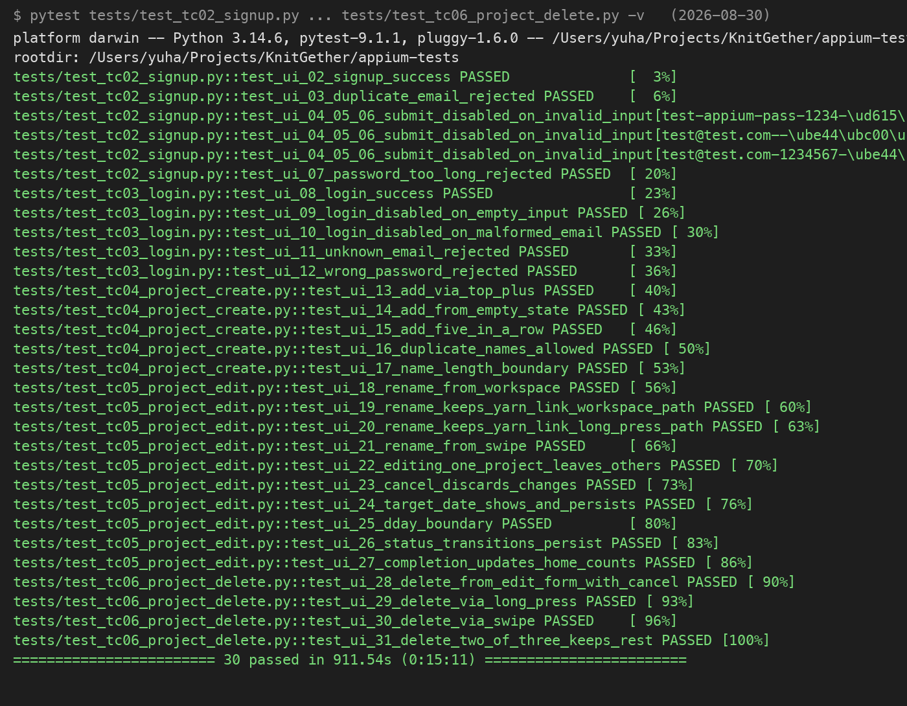
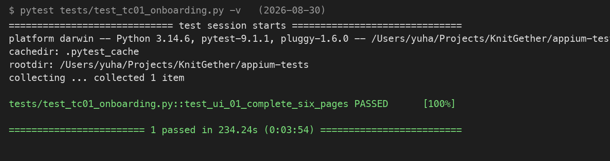

# 13_자동화 테스트 스위트

> 2026-09-18 재작성. 규모 수치는 원본(`docs/qa/portfolio/13`)의 2026-08-27 리포지토리 실측을, 실행 이력과 설계 원칙은 `docs/qa/appium_suite_worklog_2026-08-27.md`(최종 갱신 8/29)를 옮겼다. 원본 6절의 부채 목록은 이후 경과를 붙여 8절로 합쳤다. 함수가 존재한다는 사실과 통과한다는 판정은 다르다. 여기 수치는 전자이고, 실행 판정은 11과 12가 다룬다.

#### 이 문서의 위치

ISTQB 4.0 테스트 프로세스의 구현 활동 산출물이다. 구현 활동은 설계 활동이 만든 테스트 케이스를 실행 가능한 테스트 절차와 자동화 스크립트로 옮기고, 그것을 테스트 스위트로 묶는 일이다. 29119-3에서는 테스트 절차 명세에 해당한다. 자동화 스크립트는 테스트 절차를 코드로 적은 것이므로 이 대응을 따른다. 케이스 카탈로그는 09, 도구 선정과 실행 환경 조건은 08이 맡는다.

#### 1. 산출물 경계

리포지토리에는 두 종류의 테스트가 섞여 있다. 섞어서 세면 숫자가 부풀려지므로 먼저 가른다.

| 테스트웨어 | 작성 주체 | 규모 (8/27 실측) | 포트폴리오 대상 |
| --- | --- | --- | --- |
| Appium 스위트 (`qa/appium/`) | QA | 함수 78, POM 12, support 6 | 예 |
| XCUITest QA 타깃 (`KnitGetherQAUITests/`) | QA | 실테스트 1(`testDEF15`), POM 3 | 예 |
| 결함 주입 도구 (`qa/mutation/`) | QA | 주입 6종 | 예 |
| Postman 컬렉션 | QA | 최상위 요청 12 | 예 (07의 도구) |
| XCUITest 개발 타깃 (`KnitGetherUITests/`) | AI (개발 단계) | 메서드 23, 파일 20 | 아니오. 회귀 장치로만 쓴다 |
| Swift 단위 테스트 (`KnitGetherTests/`) | AI (개발 단계) | `@Test` 329, 파일 41 | 아니오. CI 게이트 회귀 장치 |
| 서버 e2e (`server/test/`) | AI (개발 단계) | `it()` 117, 스펙 12 | 아니오. CI 게이트 회귀 장치 |
| pytest API (`qa/api-tests/`) | AI (개발 단계) | 파일 6 | 아니오 |

04가 "단위 테스트는 재작성하지 않고 CI 게이트에서 회귀 장치로 활용한다"고 선언했고, 이 표가 그 선언의 실제 모습이다. AI가 만든 것을 QA 실적으로 세지 않되 버리지도 않는다.

개발 타깃 XCUITest 23건과 단위 329건은 06에서 밝힌 함정의 당사자이기도 하다. AI가 쓴 단위 테스트 하나(`rejectedPendingLocalOnly`)가 데이터 유실 동작(DEF-03)을 정상으로 단언하고 있었다. **회귀 장치로 쓰되 판정 근거로는 쓰지 않는다.**

#### 2. Appium 스위트의 구성

| 구성 | 수 | 위치 |
| --- | --- | --- |
| 테스트 함수 | 78 (`test_ui_01`~`test_ui_78`). UI-04~06은 함수 1개, UI-42와 UI-51은 각 2개. pytest 실행 항목은 80 | `qa/appium/tests/` |
| 테스트 파일 | 18 (`test_tc01`~`test_tc16`, TC10은 a, b, c로 분할) | 같은 곳 |
| Page 객체 | 12 | `qa/appium/pages/` |
| support 모듈 | 6 | `qa/appium/support/` |
| 픽스처 | 6 | `qa/appium/conftest.py` |

파일 이름이 TC 그룹(`test_tc08_sort_filter.py`)이고 함수 이름이 케이스 ID(`test_ui_33_recent_work_moves_to_top`)다. 09 카탈로그의 케이스와 코드가 이름으로 직접 추적된다. 케이스 설계 시트 UI-01~UI-78 전건을 옮겼다.

Page 객체 12개는 `base_page`(공통 조작 28개), `auth`, `onboarding`, `home`, `my_knitting`, `project_form`, `project_info`, `workspace`, `counter_panel`, `pattern_panel`, `work_time_panel`, `library`다. 04에서 선언한 대로 Page(화면)와 Test(여정)를 분리했다. 화면이 바뀌면 Page만, 시나리오가 바뀌면 Test만 고친다.

| support 모듈 | 역할 |
| --- | --- |
| `simctl` | 시뮬레이터 제어(13개 함수). 앱 상태 조회, 파일 앱 주입, 재실행 |
| `seed` | Given 상태 주입. 프로젝트와 창고 항목을 코드로 만들어 전제를 통제한다 |
| `server_api` | 테스트용 서버 직접 호출 |
| `netgate` | 네트워크 차단과 복구 (오프라인 케이스용) |
| `paths` | 리포지토리 루트 기준 경로 해석 |
| `texts` | 화면 문구 상수. 문구가 바뀌면 한 곳만 고친다 |

픽스처는 `_pool`(세션 스코프 드라이버 풀), `kg`(기본), `kg_server`(서버 필요), `kg_offline`(네트워크 차단), `netgate`, `onboarding`(온보딩 미완료 상태)이다. 드라이버를 세션 스코프 풀로 재사용해 케이스마다 Appium 세션을 새로 여는 비용을 없앴다. 이 풀이 필요했던 이유는 08의 3절에 있다.

#### 3. 스크립트 작성 원칙

구현하면서 두 원칙을 세웠다(appium 워크로그 1절).

| 원칙 | 이유 |
| --- | --- |
| 이동은 반드시 도착까지 확인한다 | 탭만 하고 넘어가면 애니메이션이 끝나기 전에 다음 요소를 찾고, 엉뚱한 화면의 같은 이름 요소를 눌러도 조용히 통과한다. 홈의 이어서 뜨기 카드가 DEF-17로 동작하지 않아 이 함정에 실제로 빠진 적이 있다 |
| 오버레이는 좌표로 다룬다 | 컨텍스트 메뉴, 액션 시트, 롱프레스, 시트 안 목록 행은 `element.click()`이 조용히 무시된다. 시트 안 목록 행은 라벨이 왼쪽 정렬이라 가운데가 히트 영역 밖인 경우도 있었다 |

두 번째 원칙은 뒤에 보강됐다. 오버레이 메뉴 탭이 15회 시도 중 3회(20퍼센트) 유실되는 것을 실측했고, 원인을 두 개로 나눠 고쳤다. 세션 생성 직후 `boundElementsByIndex`를 켜 오버레이 항목이 클릭을 받게 했고(`a784be7`), 게이지 행 롱프레스는 제목 텍스트가 아니라 행 컨테이너 중심을 누르게 했다(`04095bd`). 게이지 행 기준선은 3 failed, 2 passed였고 수정본은 5 passed, 0 failed였다. 앱 코드는 건드리지 않았다.

#### 4. 검증 자체를 검증하는 두 장치

전건 PASS는 제품이 정상이거나 테스트가 아무것도 보지 않는다는 뜻이다. 둘을 가르는 장치를 스위트에 넣었다. 결과는 08의 4절에 있다.

`pytest --empty-given`은 Given 주입을 건너뛴다. 전제가 사라졌으니 테스트는 FAIL해야 정상이고, 그래도 PASS하는 테스트는 전제와 무관하게 통과하므로 검출력이 없다.

```python
parser.addoption(
    "--empty-given", action="store_true",
    help="Given 주입을 건너뛴다. 음성 대조용: 전제가 사라지면 테스트가 FAIL해야 정상이고, "
         "그래도 PASS하는 테스트는 검출력이 없는 것이다.")
```

결함 주입은 제품 코드에 고장을 하나씩 심고 빌드해서 지정한 케이스만 정확히 실패하는지 본다. 엉뚱한 케이스가 같이 터지면 그 테스트는 과잉 결합이라 분리 대상이다. 실행 명령은 `python3 qa/mutation/run_mutation.py --all`이다.

| 주입 | 심는 고장 | FAIL 기대 케이스 |
| --- | --- | --- |
| `counter-lower-bound` | 카운터 하한을 뷰와 ViewModel 두 층에서 모두 제거 (DEF-15 재현) | `test_ui_54`, `test_ui_52` |
| `delete-without-confirm` | 삭제 확인창을 건너뛰고 즉시 삭제 | `test_ui_29`, `test_ui_31` |
| `sort-reversed` | 정렬을 뒤집어 오래된 프로젝트가 위로 | `test_ui_34` |
| `favorite-not-pinned` | 즐겨찾기 우선 정렬 제거 | `test_ui_37` 계열 |
| `counter-not-saved` | 단수를 화면에만 반영하고 저장 안 함 | 재실행 보존 케이스 |
| `no-owner-filter` | 서버 목록의 소유자 격리를 세 층에서 모두 제거 (where 절, 자식 필터, toResponse) | 계정 격리 케이스 |

`counter-lower-bound`와 `no-owner-filter`가 여러 층을 동시에 무너뜨리는 이유는 이중 방어 때문이다. 한쪽만 깨면 다른 쪽이 막아 테스트가 터지지 않고, 그러면 검출력을 측정할 수 없다. 방어 구조를 먼저 읽고 주입 지점을 정했다.

#### 5. XCUITest를 1건만 직접 쓴 이유

QA 타깃 `KnitGetherQAUITests/`의 실제 테스트는 `testDEF15` 한 건이다. 나머지 3개(`testExample`, `testLaunch`, `testLaunchPerformance`)는 Xcode 템플릿 잔여물이다. POM은 `MyKnittingPage`, `WorkspacePage`, `CounterSheetPage` 3개다. 1건인 것은 부족이 아니라 선정 결과다.

| 질문 | 답 |
| --- | --- |
| 왜 DEF-15인가 | QA 사이클 중 UX 개편이 만든 회귀다. 코드 동결 원칙을 실증한 결함이라 CI가 상시 감시할 가치가 가장 크다. 판정도 명확하다(0에서 감소 후 값이 늘면 실패) |
| 왜 XCUITest인가 | CI에서 돌리므로 별도 런타임(Appium 서버, Python 환경) 없이 `xcodebuild` 한 줄로 끝나야 한다 |
| 왜 나머지는 Appium인가 | 78건은 로컬 실행이고 POM 재사용, Python 시딩, 네트워크 제어가 필요하다 |

같은 DEF-15 경로를 XCUITest와 Appium 양쪽으로 구현한 것은 도구 비교를 위해서다. 시트에는 XCUITest 37.3초, Appium 32.6초가 적혀 있다. 측정 조건이 기록되지 않아 08은 이 숫자를 비교 근거로 쓰지 않는다.

#### 6. CI 품질 게이트

`.github/workflows/qa-gate.yml`이다. 트리거는 `fix/qa-cycle-defects` 푸시와 수동 실행이다.

| 단계 | 내용 |
| --- | --- |
| 1 | 시뮬레이터 선택. 사용 가능한 iPhone을 자동 탐색하고 UDID를 하드코딩하지 않는다 |
| 2 | `build-for-testing`. 빌드 자체가 깨지면 여기서 멈춘다 |
| 3 | 단위 회귀. `KnitGetherTests` 전건 (`-parallel-testing-enabled NO`) |
| 4 | DEF-15 UI 회귀. `KnitGetherQAUITests/DEF_15_RegressionTests/testDEF15` |
| 5 | 실패 시 `.xcresult` artifact 업로드 (`if: always()`) |

단위 329건을 통째로 넣은 이유는 AI 작성분이라도 회귀 감지 그물로는 유효하기 때문이다. 판정 근거로 쓰지 않을 뿐이다. Appium 78건은 CI에 넣지 않았다. Appium 서버와 시뮬레이터 상태 의존이 커서 CI 안정성을 해치므로 로컬 실행 스위트로 유지한다. `if: always()`로 artifact를 남기는 이유는 실패했을 때가 증거가 가장 필요한 순간이기 때문이다.

#### 7. 자동화 범위 밖

| 대상 | 처리 | 이유 |
| --- | --- | --- |
| 카메라 문서 스캔 (UI-42) | 실기기 수동 | 입력을 통제할 수 없어 자동 판정이 성립하지 않는다 |
| 파일 선택기 경로 (UI-40, 41) | 시스템 UI 통과 후만 자동 | 경계 절단 원칙. OS 업데이트마다 바뀌고 앱 코드 밖이다 |
| 오프라인 복구 동기화 (UI-78) | 수동 트랙 | 네트워크 제어 비용이 발견 가치를 넘는다. 치명도 1위지만 자동화 대상은 아니다 |
| P1 악조건 시나리오 (트랙 B 6건) | 수동 유지 | 다중 기기, Charles breakpoint, psql 주입이 얽힌다 |
| 성능 정량 판정 | 제외 | 명세 공백. 1000건 주입 시 정상 동작만 관찰하고 판정 기준은 세우지 않았다 |

#### 8. 스위트의 실행 이력과 부채

스위트 준비 상태를 확인한 통합 실행 이력이다(appium 워크로그 2절).

| 회차 | passed | failed | errors | 비고 |
| --- | --- | --- | --- | --- |
| 1 | 71 | 1 | 2 | xfail 6건 포함 |
| 4 | 72 | 1 | 0 | |
| 6 | 72 | 1 | 0 | |
| 7 | 76 | 3 | 0 | 결함 수정 후, xfail 0 |
| 10 | 76 | 1 | 2 | |
| 11 | 55 | 5 | 19 | WDA 사망 |

1회차부터 6회차까지 passed가 71~72에 머문 것은 미수정 결함 6건이 xfail 상태였기 때문이다. 11회차 에러 19건은 50분 연속 실행을 WebDriverAgent가 버티지 못한 결과이고, 실제 판정 실패인 `AssertionError`는 1건뿐이었다. 파일 단위 분할 실행으로 바꾼 뒤 플레이키 두 건을 고치고 2026-08-29에 세 번 돌렸다. 정방향 2회와 역순 1회가 모두 79 passed, 1 skipped, 0 failed였다. 역순 회차는 파일 순서와 파일 안 케이스 순서를 둘 다 뒤집었다. 앞 케이스가 남긴 상태에 뒤 케이스가 기대고 있으면 정방향으로는 드러나지 않기 때문이다. skipped 1건은 UI-42b 실기기 문서 스캔이다.

2026-08-30 재실행에서는 TC1 온보딩 6페이지 완주 1건과 TC2~TC6 회원가입부터 프로젝트 삭제까지 30건이 전건 통과했다. 환경은 iPhone 17 Pro Max 시뮬레이터, Appium 3.1.2, Python 3.14다.





원본은 8/27 시점의 부채 다섯 개와 남은 판단 네 개를 적었다. 그 뒤 경과를 붙여 한 표로 모은다.

| # | 8/27 부채 | 경과 | 근거 |
| --- | --- | --- | --- |
| 1 | 실행 증거가 없다. `qa/appium/failures/`가 비어 있고 실행 리포트가 없다 | 해소. 8/29 분할 실행 3회 동일 결과, 8/30 재실행 스크린샷 | appium 워크로그 2절, 위 증거 |
| 2 | `qa/mutation/run_mutation.py`에 UDID와 DerivedData 해시 경로가 하드코딩돼 있다. `27aed16`이 `injections.py`와 `paths.py`만 루트 기준으로 바꿨다 | 미해소. 다른 기계에서 돌아가지 않는다 | 2026-09-18 파일 확인 |
| 3 | `qa/appium/conftest.py`에 미커밋 변경(최신 빌드 선택)이 있다 | 해소. 커밋 이력에 포함됐다 | `git log` |
| 4 | UI-04, 05, 06이 함수 하나(`test_ui_04_05_06_submit_disabled_on_invalid_input`)로 합쳐져 실패 시 어느 케이스인지 구분되지 않는다 | 미해소. `parametrize` 3분기로 실행 단위는 나뉘지만 함수는 하나다 | 2026-09-18 파일 확인 |
| 5 | 미푸시 커밋 10건. 스위트 전체가 로컬에만 있다 | 해소. 원격 브랜치와 차이 0건 | 2026-09-18 `git rev-list` |
| 6 | (8/27 이후 추가) `full_reset=False`에서 스위트가 앱을 설치하지 않아 예전 바이너리를 검증했다 | 해소. 검증할 바이너리를 특정하게 바꿨다(`a1dcc18`) | fix_cycle 워크로그 4절, 5-5절 |
| 7 | (8/27 이후 추가) 장시간 실행의 세션 저하 | 해소 (`ce4d8c0`) | 08의 6절 |

| # | 8/27 남은 판단 | 경과 |
| --- | --- | --- |
| 1 | 스위트 1회 완주 후 78건의 실제 판정 | 위 부채 1과 같이 해소 |
| 2 | 뮤테이션 6종의 기대 FAIL과 통제군 확인 | 6종 전건 검출, 과잉 결합 0건 (08의 4절) |
| 3 | `--empty-given` 전건 실행 후 검출력 없는 케이스 식별 | 53건 FAIL, 검출력 없음 0건. 서버 케이스 14건은 이 장치의 사각으로 남는다 (08의 4절) |
| 4 | 부채 2~4의 처리 여부와 우선순위 | 3은 해소, 2와 4는 미해소 |

<!--
출처 메모
1. 8절 부채 표의 경과 열 가운데 2, 3, 4, 5번은 원본 문서가 아니라 2026-09-18 리포지토리 확인(run_mutation.py 21~24행, conftest.py git status, test_tc02_signup.py 44~49행, origin 대비 커밋 차이)에서 왔다.
2. 원본 13 6절 2번의 UDID 앞자리 값은 옮기지 않았다.
-->
