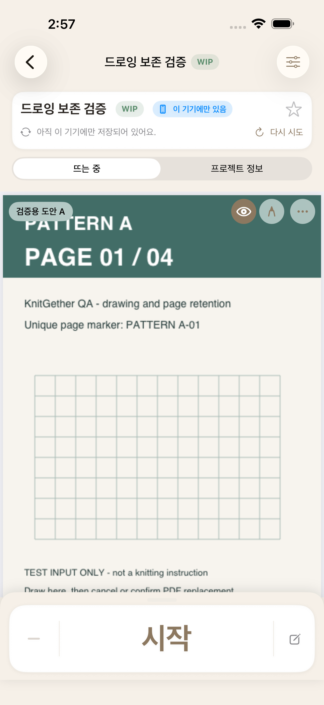
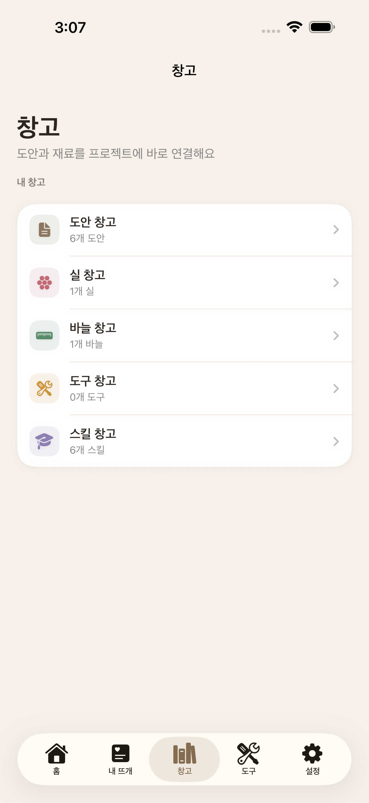
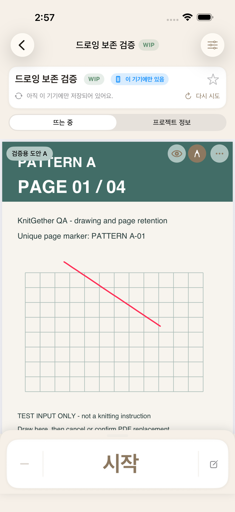
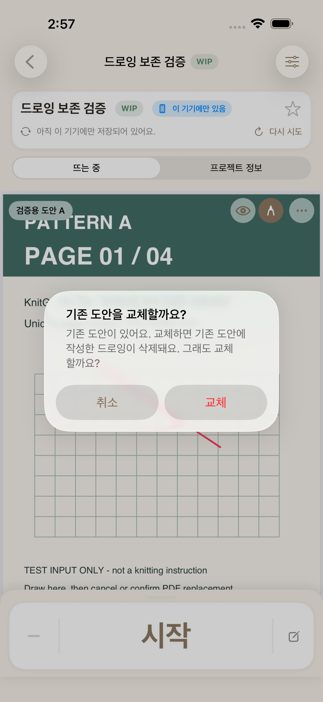
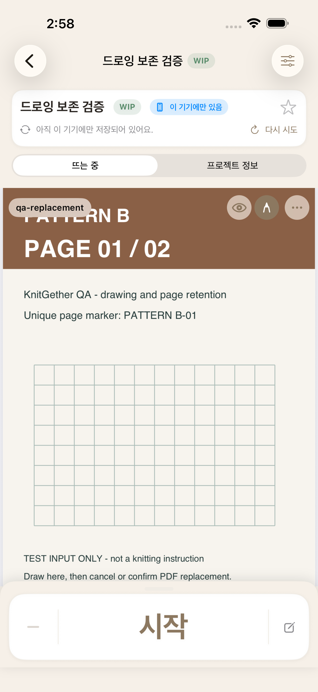
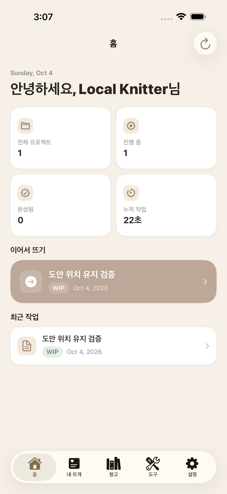
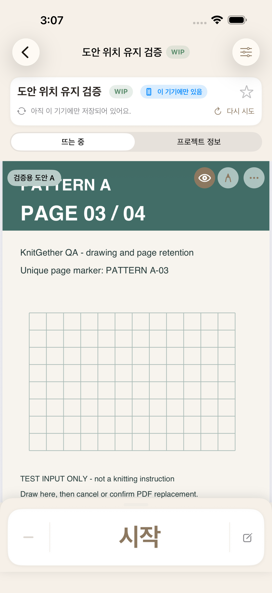

# 뜨개더 iOS 앱 QA

유하은 / iOS 앱 기능과 데이터 정합성 검증

## 01 프로젝트와 역할

### 기획 배경

뜨개질 중 도안과 기술 설명을 오가면 작업 위치를 다시 찾아야 하고, 실과 바늘, 도구 정보도 따로 관리하게 됩니다. 이를 한 프로젝트 안에서 관리하도록 뜨개더를 기획했습니다. 도안 보기, 단수 카운터, 작업 기록을 중심으로 도안과 실, 바늘, 도구, 스킬 창고를 연결합니다.

<!-- photo-width: 130 -->

| 작업 화면 | 창고 화면 |
|:---:|:---:|
|  |  |
| 도안을 보며 단수를 기록 | 프로젝트에 연결할 도안과 재료 및 스킬 관리 |

테스트 데이터를 준비해 iOS 시뮬레이터에서 촬영한 앱 화면입니다.

<!-- pagebreak -->

### 담당 역할과 검증 환경

**앱 기획**

- 뜨개 작업에 필요한 기능 정의
- 프로젝트와 창고 및 작업 화면의 연결 관계 설계

**테스트 설계**

- 기능별 테스트 시나리오 설계
- AI의 구현 분석을 참고해 실제 사용 흐름에 맞는 기대 결과와 검증 조건 정의
- Appium 자동화 대상 기능과 테스트 조건 정의

**QA 수행**

- 앱 수동 테스트 수행
- Postman API 응답 확인과 SQL 저장값 대조
- Charles 응답 중단과 요청 변경 상황에서 앱의 기록 유지 여부와 오류 안내 확인
- Appium 테스트 코드 보완, 실행 및 실패 결과 확인

앱과 API 서버 구현에는 AI 도구를 활용했습니다.

**주요 검증 관점**

- **작업 기록 보존:** 앱 재실행, 서버 응답 중단, 도안 교체 취소 시 단수와 작업 기록 및 드로잉이 유지되는지 확인
- **데이터 정합성:** API 응답과 DB 저장값을 대조하고, 프로젝트와 단수 정보의 연결 관계 확인

### 검증 대상과 환경

- 검증 대상: SwiftUI iOS 앱, 앱 로컬 저장소, NestJS API 서버, PostgreSQL DB
- 수동 테스트: iPhone 실기기와 iOS 시뮬레이터
- Appium UI 자동화: iOS 시뮬레이터

[GitHub: 앱 코드와 QA 상세 기록](https://github.com/uhaeun/knitgether-app)

## 02 테스트 전략과 설계

### 검증 우선순위

사용 흐름과 예외 상황을 기준으로 테스트를 설계했습니다. 다음 두 문제를 높은 우선순위(P1)로 두었습니다.

1. **작업 기록 유실:** 통신 중단과 복구, 앱 종료, 여러 기기의 수정 과정에서 기록이 사라지는지 확인
2. **계정 간 데이터 노출:** 이전 계정의 기록이 보이거나 다른 계정 소유로 업로드되는지 확인

### 테스트 범위와 케이스 구성

| 영역 | 설계한 테스트 내용 |
|---|---|
| 가입과 로그인 | 온보딩, 입력 조건, 로그인 실패, 로그아웃, 계정 구분 |
| 프로젝트 관리 | 생성, 수정, 삭제, 정렬, 필터, 즐겨찾기 |
| 작업 화면 | 도안, 드로잉, 단수, 스킬 조회, 화면 복귀 후 상태 유지 |
| 창고 | 실과 바늘 및 도구의 등록, 수정, 삭제, 프로젝트 연결 |
| 저장과 동기화 | 통신 중단과 복구, 수정 충돌, 앱 재실행, 저장 거부 시 기록 보존 |

사용 흐름과 예외 상황을 다룬 설계 묶음은 22건입니다. 주요 사용 흐름과 기능 간 연결 4건, 기록 유실과 계정 분리의 예외 상황 6건, 기능별 동작과 예외 처리 12건으로 구성했습니다. 이후 추가한 UI 및 API 자동화 테스트는 별도로 관리했습니다.

[근거: 품질 리스크맵](https://github.com/uhaeun/knitgether-app/blob/90bb07aa3a1a507888c5de24d6b660e53145914c/docs/qa/portfolio/03_quality_risk_map.md)

[테스트 케이스 목록과 대표 설계](https://github.com/uhaeun/knitgether-app/blob/90bb07aa3a1a507888c5de24d6b660e53145914c/docs/qa/portfolio/05_test_cases.md)

[UI와 API 테스트 범위](https://github.com/uhaeun/knitgether-app/blob/90bb07aa3a1a507888c5de24d6b660e53145914c/docs/qa/portfolio/09_test_case_master.md)

<!-- pagebreak -->

### 검증 방법과 수정 후 확인

화면의 표시와 실제 저장 결과가 일치하는지 확인하기 위해 앱, API, DB를 함께 검증했습니다.

| 검증 방법 | 도구와 환경 | 확인 내용 |
|---|---|---|
| 앱 수동 테스트 | iPhone과 시뮬레이터 | 사용 흐름, 화면 이동, 계정 변경 후 상태 |
| API 수동 확인 | Postman | 응답 코드와 반환 데이터 |
| 통신 조건 제어 | Charles | 요청과 응답, 응답 중단 및 요청값 변경 후 앱 동작 |
| DB 직접 확인 | PostgreSQL | SQL로 저장값과 소유자, 연결 관계 대조 및 오류 조건 생성 |
| UI 자동화 | Appium | 화면 조작 후 표시와 상태 유지 |
| API 자동화 | pytest | API 요청과 SQL 검증으로 응답 및 저장값 확인 |
| 내부 기능 테스트 | Swift Testing | 계정별 저장 폴더 삭제 등 내부 기능의 실행 결과 |

### 기대 결과를 구체화한 예

- 도안 교체를 취소하면 기존 도안과 드로잉이 유지되어야 합니다.
- 단수 정보가 누락된 항목이 있어도 정상 프로젝트는 조회되어야 합니다.
- 계정을 바꾼 뒤에는 이전 계정의 기록이 보이거나 새 계정 소유로 업로드되지 않아야 합니다.

### 수정 후 확인

수정한 기능은 관련 Appium 또는 API 테스트로 다시 확인했습니다. 통신 중단 시점에 따른 복구처럼 수동 검증이 필요한 조건은 자동화와 구분해 유지했습니다.

## 03 주요 검증 사례

### 03-1 도안 교체 시 드로잉 유실 (DEF-10)

#### 문제와 QA 판단

PDF 도안에 드로잉이 있는 상태에서 다른 도안으로 교체하면, 삭제 안내나 확인창 없이 기존 드로잉이 사라졌습니다. 파일 교체 자체는 성공해도 사용자 기록이 예고 없이 없어지므로 데이터 유실로 판단했고, 결함 분류를 변경했습니다.

#### 테스트 조건과 기대 결과

드로잉이 저장된 도안을 준비하고, 교체 전 존재 여부부터 사용자의 선택에 따른 결과까지 나눴습니다.

| 테스트 조건 | 기대 결과 |
|---|---|
| 교체 전 | 기존 도안에 저장한 드로잉 존재 |
| 교체 시도 | 드로잉 삭제 안내와 확인창 표시 |
| 교체 취소 | 기존 도안과 드로잉 유지 |
| 삭제 안내 후 승인 | 새 도안으로 교체되고 이전 드로잉 제거 |

#### 수정과 재검증

교체 전에 삭제 안내와 확인창이 추가됐습니다. Appium은 선을 그린 뒤 ‘그리기 삭제’ 메뉴가 나타나는지 확인하고, 교체 취소 후에는 메뉴가 유지되며 승인 후에는 사라지는지를 검사했습니다. 메뉴 표시 여부로 앱의 드로잉 상태를 간접 확인하는 방식입니다.

PDF 직접 교체 경로의 추가 촬영 화면에서는 교체 취소 후 선이 남고, 승인 후에는 사라진 모습을 확인했습니다. 앱 재실행 후에도 도안 B와 드로잉 제거 상태가 유지됐습니다. 이 자동 테스트는 선의 모양이나 저장 파일의 내용을 직접 비교하지 않습니다.

#### 이 사례에서 배운 점

파일 교체 성공 여부와 함께, 기록이 어떤 선택을 거쳐 삭제되는지 확인해야 합니다. 취소 경로도 데이터 보존의 핵심 검증 조건입니다.

[결함과 수정 기록](https://github.com/uhaeun/knitgether-app/blob/90bb07aa3a1a507888c5de24d6b660e53145914c/docs/qa/portfolio/10_defect_catalog.md)

[Appium UI-45: 교체 취소와 승인](https://github.com/uhaeun/knitgether-app/blob/90bb07aa3a1a507888c5de24d6b660e53145914c/qa/appium/tests/test_tc10a_workspace_pattern.py#L180-L199)

[드로잉 상태 판정 코드](https://github.com/uhaeun/knitgether-app/blob/90bb07aa3a1a507888c5de24d6b660e53145914c/qa/appium/pages/pattern_panel_page.py#L296-L298)

<!-- pagebreak -->

### 03-1 수정 후 검증 화면

촬영: 2026-10-04, iOS 26.5 시뮬레이터, Appium. [재실행 화면과 실행 기록](evidence/2026-10-04/README.md)

<!-- photo-width: 105 -->

| ① 교체 전 | ② 교체 시도 |
|:---:|:---:|
|  |  |
| 도안 A에 남긴 드로잉 | 드로잉 삭제 안내 표시 |

| ③ 취소 후 | ④ 승인 후 |
|:---:|:---:|
|  |  |
| 기존 도안과 드로잉 유지 | 도안 B로 변경되고 드로잉 제거 |

### 03-2 단수 정보 누락으로 목록 조회 실패 (DEF-08)

#### 문제와 재현 조건

단수 정보가 누락된 프로젝트 한 건 때문에 전체 목록 조회가 실패했습니다. 정상 프로젝트와 오류 대상 프로젝트를 만든 뒤, DB에서 오류 대상의 단수 정보만 제거해 API 응답을 비교했습니다.

#### 원인 분석과 QA 판단

서버가 단수 정보가 없는 프로젝트를 응답으로 변환하다 오류를 내면서, 목록 전체에 HTTP 500을 반환했습니다. 한 항목의 불완전한 데이터가 정상 프로젝트의 작업 진입까지 막는 문제였습니다.

앱에는 이전 목록이 남아 있어 화면만 보면 정상 조회로 오인할 수 있었습니다. 기존 실행 기록에서도 서버 단수를 99로 바꿔도 앱에는 22가 표시돼, 화면과 API 응답 및 DB 저장값을 함께 대조했습니다.

#### 수정 전후 비교

| 비교 조건 | 확인 결과 |
|---|---|
| 수정 전, 단수 정보가 없는 항목 포함 | HTTP 500으로 목록 전체 조회 실패 |
| 수정 후, 같은 DB 조건으로 조회 | HTTP 200과 정상 프로젝트 반환, 오류 항목 제외 |

#### 재검증과 남은 확인 범위

pytest 기반 API 테스트는 정상 프로젝트와 오류 대상을 생성한 뒤 SQL로 단수 정보를 삭제 상태로 바꾸고, HTTP 200과 정상 항목 포함 및 오류 항목 제외를 확인합니다. 최초 재현은 레코드 제거, 자동화는 삭제 상태 변경 조건입니다.

정상 목록 반환을 확인했습니다. 오류 항목의 개별 조회에는 HTTP 500이 남아 있으며, 해당 항목의 복구와 오류 안내는 후속 개선 범위입니다.

#### 이 사례에서 배운 점

DB의 불일치가 API 응답과 사용자의 작업 진입에 미치는 영향을 연결해 판단했습니다.

[DEF-08 재현과 수정 전후 비교](https://github.com/uhaeun/knitgether-app/blob/90bb07aa3a1a507888c5de24d6b660e53145914c/docs/qa/portfolio/10_defect_catalog.md)

[API-21: 정상 목록 보존](https://github.com/uhaeun/knitgether-app/blob/90bb07aa3a1a507888c5de24d6b660e53145914c/qa/api-tests/test_13_row_counter_isolation.py#L21-L61)

### 03-3 탭 복귀 후 도안 페이지 초기화 (DEF-19)

#### 문제와 검증 조건

사전 조회 후에는 보던 페이지가 유지됐지만, 홈 탭을 거쳐 돌아오면 3페이지가 1페이지로 초기화됐습니다. 같은 작업을 이어가는 흐름을 기준으로 탭 복귀 시에도 페이지를 유지하도록 기대 결과를 추가했습니다.

#### 수정과 재검증

페이지를 저장하고 복원하도록 수정됐습니다. 이후 재검증에서는 빈 결과도 같다고 판정하던 테스트를 보완했습니다. Appium으로 실제 페이지 이동을 확인하고, 홈 탭과 사전 조회에서 복귀한 뒤 같은 페이지의 고유 표시가 유지되는지 검사해 두 경로 모두 통과했습니다. 앱 재실행 후 페이지 유지는 당시 보장 범위 밖이었습니다.

<!-- photo-width: 125 -->

| 홈 탭으로 이동 | 같은 프로젝트에 복귀 |
|:---:|:---:|
|  |  |
| 작업 화면에서 목록과 홈으로 이동 | 보던 3페이지로 복귀 |

촬영: 2026-10-04 추가 검증은 4페이지 테스트 도안을 사용했습니다. 이동 전후 같은 3페이지가 표시되는지 확인했습니다.

[기대 결과 확정과 실행 기록](https://github.com/uhaeun/knitgether-app/blob/90bb07aa3a1a507888c5de24d6b660e53145914c/docs/qa/portfolio/06_manual_execution.md)

[Appium UI-51: 경로별 페이지 유지](https://github.com/uhaeun/knitgether-app/blob/90bb07aa3a1a507888c5de24d6b660e53145914c/qa/appium/tests/test_tc10a_workspace_pattern.py#L292-L341)

[보완한 두 경로의 재실행 결과](https://github.com/uhaeun/knitgether-app/blob/90bb07aa3a1a507888c5de24d6b660e53145914c/docs/qa/validation/2026-10-04/evidence/appium-page-final.xml)

[추가 촬영과 실행 기록](evidence/2026-10-04/README.md)

### 03-4 계정 변경 후 이전 계정 기록 노출 (DEF-05~07)

#### 문제와 검증 조건

A 계정에서 로그아웃한 뒤 B 계정으로 로그인했는데, 앱에 다른 계정의 프로젝트가 함께 표시됐습니다. 계정 전후의 화면과 API 응답을 비교하고, 다른 계정 소유로 업로드되는지도 별도로 확인했습니다.

#### 원인 분석과 QA 판단

서버는 현재 계정의 프로젝트 4건을 반환했지만 앱에는 5건이 표시됐습니다. 로그아웃 시 이전 계정의 데이터가 미로그인 저장 영역으로 복사돼, 새 계정에서도 노출되는 문제였습니다.

다른 계정의 기록이 화면에 보이는 것은 결함으로 판단했습니다. 다만 다른 계정 소유로의 업로드 요청과 서버의 새 프로젝트 생성은 모두 0건이었습니다. 관련된 DEF-05~07은 하나의 사례로 묶었습니다.

#### 수정과 재검증

로그아웃 시 계정별 저장 데이터를 정리하고, 미로그인 상태에서 이전 기록을 숨기도록 수정됐습니다. 미업로드 기록은 먼저 업로드를 시도하고, 남으면 안내 후 로그아웃 여부를 선택하도록 했습니다.

| 검증 방법 | 확인한 내용 |
|---|---|
| Appium 화면 테스트 | 다른 계정 기록 노출 여부, 로그아웃 후 계정 정보와 프로젝트 숨김, 앱 재실행 후 로그아웃 상태 유지 |
| Swift Testing 내부 기능 테스트 | 임시 A, B 계정 폴더를 만들고 A의 삭제 함수를 실행해 A만 삭제되고 B는 유지되는지 확인 |

자동화 범위는 위의 화면 상태와 저장 폴더 정리이며, A에서 B로 전환하는 모든 경로를 포함하지는 않습니다.

#### 이 사례에서 배운 점

서버의 소유자 구분이 정상이어도 앱에 남은 데이터가 노출될 수 있어, API와 화면 및 로컬 저장소를 함께 확인해야 합니다.

[계정 변경 시 노출과 업로드 구분](https://github.com/uhaeun/knitgether-app/blob/90bb07aa3a1a507888c5de24d6b660e53145914c/docs/qa/portfolio/06_manual_execution.md)

[Appium UI-77](https://github.com/uhaeun/knitgether-app/blob/90bb07aa3a1a507888c5de24d6b660e53145914c/qa/appium/tests/test_tc15_logout.py#L23-L49)

[계정별 저장 폴더 테스트](https://github.com/uhaeun/knitgether-app/blob/90bb07aa3a1a507888c5de24d6b660e53145914c/KnitGetherTests/AppRepositoryContainerTests.swift#L612-L648)

### 03-5 앱 강제 종료 후 단수 기록 복구 (TC-CNT02-01)

#### 검증 목적과 조건

단수를 변경한 뒤 앱이 종료되더라도 마지막 입력이 유지되는지 확인했습니다. 단수 0에서 시작해 3까지 변경하고, 저장 성공 응답을 받은 뒤와 응답 대기 중에 앱을 종료하는 조건을 나눴습니다.

앱의 화면 값, Charles의 요청과 응답, SQL로 조회한 서버 저장값을 대조했습니다. 앱 내부 저장값도 확인 대상으로 포함했습니다.

| 종료 조건 | 기대 결과 |
|---|---|
| 저장 성공 응답 확인 후 강제 종료 | 재진입 후 화면과 서버에 단수 3 유지 |
| 세 번째 저장 응답을 Charles에서 보류한 뒤 강제 종료 | 보류한 통신 폐기 후 재실행해도 화면과 로컬에 단수 3 유지 |
| 통신 재개 후 재조회 | 서버도 최종적으로 3이 되고 앱의 값이 되돌아가지 않음 |

#### 실제 결과와 QA 판단

최종 확인값은 화면, 앱 내부 저장소, 서버 DB에서 모두 3으로 일치해 PASS로 판정했습니다. 응답을 중단해도 서버에는 이미 3이 저장됐을 수 있으므로, 응답 중단을 서버 저장 취소로 해석하지 않았습니다.

#### 이후 반복 확인

별도 결함 수정은 필요하지 않았습니다. Appium 단수 증가와 감소 테스트, pytest 기반 API 단수 저장 테스트에 관련 확인 항목을 연결했습니다. 이 자동화가 Charles로 응답 대기 상태를 만든 뒤 앱을 종료하는 수동 절차 전체를 대신하지는 않습니다.

#### 이 사례에서 배운 점

화면 반영과 서버 저장 완료 시점이 다를 수 있어, 재실행 직후의 보존과 통신 재개 후 동기화 결과를 나눠 판정했습니다.

[TC-CNT02-01 설계와 판정](https://github.com/uhaeun/knitgether-app/blob/90bb07aa3a1a507888c5de24d6b660e53145914c/docs/qa/portfolio/05_test_cases.md)

[화면과 서버 및 로컬 값 확인 기록](https://github.com/uhaeun/knitgether-app/blob/90bb07aa3a1a507888c5de24d6b660e53145914c/docs/qa/portfolio/06_manual_execution.md)

## 04 결과와 회고

### 결과와 후속 관리

- **수동 검증:** 설계 22건과 구분해 테스트 케이스 21건의 실행 결과를 기록했습니다.
- **수정 후 확인:** 드로잉 상태는 Appium의 ‘그리기 삭제’ 메뉴 표시로 간접 확인하고, 선의 유지와 제거는 추가 촬영 화면으로 확인했습니다. 정상 목록 조회는 pytest 기반 API 테스트로 반복 확인했습니다.
- **실패 분석:** 오류 로그, 실패 화면, 개별 재실행 결과를 비교해 앱 결함과 테스트 코드 오류 및 실행 환경 문제를 구분했습니다.

### 프로젝트를 통해 배운 점

1. **기대 결과도 검토 대상입니다.** 구현된 동작을 그대로 정답으로 삼지 않고, 같은 작업을 이어가는 사용자 흐름을 근거로 탭 복귀 시 도안 위치 유지 조건을 추가했습니다.
2. **DB 검증을 앱의 사용 상태까지 확장했습니다.** DB 값과 API 응답뿐 아니라 화면 이동, 계정 변경, 앱 종료 전후의 상태를 함께 대조했습니다.
3. **자동화는 통과 이유까지 확인해야 합니다.** AI가 작성한 테스트가 저장 거부 시 기록이 사라지는 동작을 정상으로 검사한 사례를 통해, 실행 성공과 요구사항 충족을 구분해야 한다는 점을 배웠습니다.

### 아쉬웠던 점과 개선 방향

- **성능 검증:** 기능 동작과 데이터 보존을 우선해 데이터 규모별 목록 조회 시간과 도안 로딩 시간을 체계적으로 측정하지 못했습니다. 데이터 규모와 응답 시간 기준을 정하고, 실기기에서 로딩 시간과 메모리 사용량을 확인하겠습니다.
- **모바일 환경:** 반복 자동화는 시뮬레이터 중심이었습니다. 실제 기기와 OS 조합을 정해 앱 종료와 복귀, 통신 복구, 권한 거부 후 재시도를 확인하고, 화면 크기와 접근성 검증도 넓히겠습니다.

[회차별 실행과 재검증 기록](https://github.com/uhaeun/knitgether-app/blob/90bb07aa3a1a507888c5de24d6b660e53145914c/docs/qa/portfolio/11_execution_results.md)

[자동화 구성과 결함 연결](https://github.com/uhaeun/knitgether-app/blob/90bb07aa3a1a507888c5de24d6b660e53145914c/docs/qa/portfolio/13_automation_showcase.md)

[요구사항 보완과 테스트 검토 과정](https://github.com/uhaeun/knitgether-app/blob/90bb07aa3a1a507888c5de24d6b660e53145914c/docs/qa/portfolio/14_observations.md)
